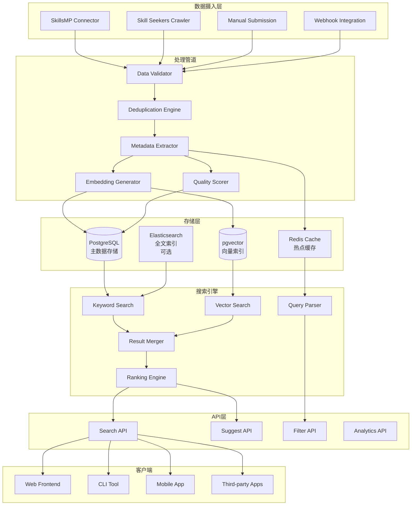
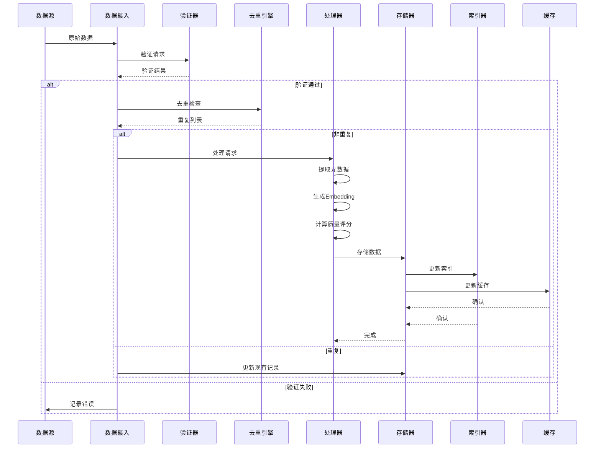
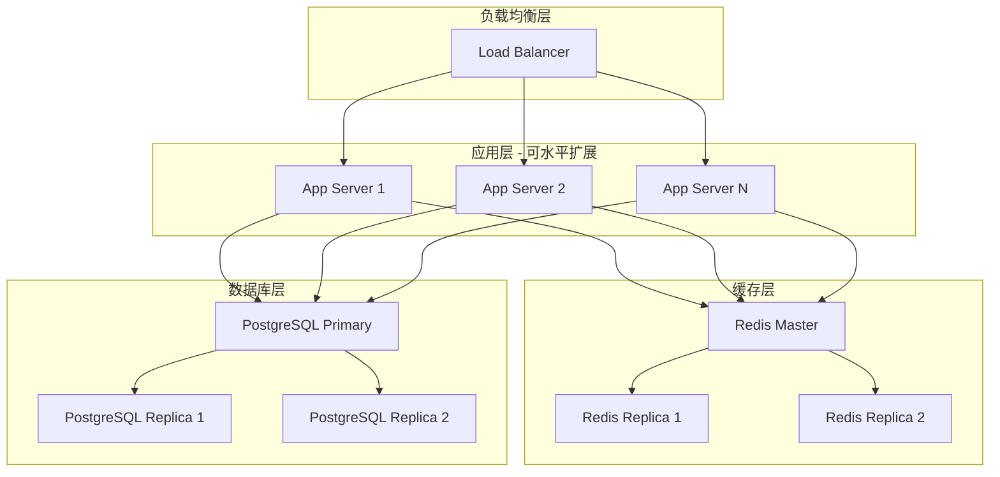

# 全球Skills搜索架构设计

> **版本**: v1.0  
> **更新日期**: 2026-04-18  
> **目标**: 设计支持数十万Skills的高性能搜索系统架构

---

## 📋 目录

- [架构概述](#架构概述)
- [核心组件](#核心组件)
- [数据流设计](#数据流设计)
- [搜索策略](#搜索策略)
- [索引优化](#索引优化)
- [性能基准](#性能基准)
- [扩展性设计](#扩展性设计)
- [容错与高可用](#容错与高可用)
- [技术选型对比](#技术选型对比)
- [实施建议](#实施建议)

---

## 架构概述

### 设计目标

Skill Hub v2.0的搜索系统需要满足：

1. **大规模**: 支持50,000+ skills索引和搜索
2. **高性能**: P95搜索响应时间 < 200ms
3. **高质量**: 搜索结果相关性强，准确率高
4. **可扩展**: 支持水平扩展，应对未来增长
5. **智能化**: 支持语义搜索和个性化推荐

### 整体架构



---

## 核心组件

### 1. 数据摄入层 (Data Ingestion)

**职责**: 从多个来源收集Skills数据

**组件**:
- **SkillsMP Connector**: 定期同步SkillsMP数据
- **Skill Seekers Crawler**: 爬取GitHub仓库
- **Manual Submission**: 用户手动提交
- **Webhook Integration**: 接收外部平台推送

**特点**:
- 异步处理，不阻塞主流程
- 支持批量和增量更新
- 错误重试机制

### 2. 处理管道 (Processing Pipeline)

#### 2.1 数据验证器 (Data Validator)

```typescript
interface ValidationResult {
  valid: boolean;
  errors: string[];
  warnings: string[];
}

class DataValidator {
  validate(skill: RawSkill): ValidationResult {
    const errors: string[] = [];
    const warnings: string[] = [];

    // 必需字段检查
    if (!skill.name) errors.push('Missing name');
    if (!skill.description) errors.push('Missing description');
    
    // 格式验证
    if (skill.version && !semver.valid(skill.version)) {
      warnings.push('Invalid version format');
    }

    // 长度限制
    if (skill.description && skill.description.length > 5000) {
      warnings.push('Description too long');
    }

    return {
      valid: errors.length === 0,
      errors,
      warnings,
    };
  }
}
```

#### 2.2 去重引擎 (Deduplication Engine)

**去重策略**:

1. **精确匹配**: 名称 + 作者完全相同
2. **URL匹配**: repository_url相同
3. **模糊匹配**: 名称相似度 > 90%
4. **内容相似**: embedding余弦相似度 > 0.95

```typescript
class DeduplicationEngine {
  async findDuplicates(candidate: Skill): Promise<Skill[]> {
    const duplicates: Skill[] = [];

    // 1. 精确匹配
    const exact = await this.exactMatch(candidate);
    duplicates.push(...exact);

    // 2. URL匹配
    if (candidate.repositoryUrl) {
      const byUrl = await this.matchByUrl(candidate.repositoryUrl);
      duplicates.push(...byUrl);
    }

    // 3. 模糊匹配
    const fuzzy = await this.fuzzyMatch(candidate.name);
    duplicates.push(...fuzzy);

    // 4. 向量相似
    if (candidate.embedding) {
      const similar = await this.vectorSimilarity(candidate.embedding);
      duplicates.push(...similar);
    }

    return this.deduplicate(duplicates);
  }

  private async exactMatch(skill: Skill): Promise<Skill[]> {
    return await prisma.skill.findMany({
      where: {
        name: skill.name,
        authorName: skill.authorName,
      },
    });
  }

  private async fuzzyMatch(name: string): Promise<Skill[]> {
    // 使用pg_trgm扩展进行模糊匹配
    return await prisma.$queryRaw`
      SELECT * FROM skills
      WHERE similarity(name, ${name}) > 0.9
      LIMIT 10
    `;
  }

  private async vectorSimilarity(embedding: number[]): Promise<Skill[]> {
    // 使用pgvector进行向量相似度搜索
    return await prisma.$queryRaw`
      SELECT *, 
        1 - (embedding <=> ${embedding}::vector) AS similarity
      FROM skills
      WHERE 1 - (embedding <=> ${embedding}::vector) > 0.95
      ORDER BY similarity DESC
      LIMIT 10
    `;
  }
}
```

#### 2.3 Embedding生成器 (Embedding Generator)

```typescript
import { OpenAI } from 'openai';

class EmbeddingGenerator {
  private openai: OpenAI;

  constructor() {
    this.openai = new OpenAI({
      apiKey: process.env.OPENAI_API_KEY,
    });
  }

  async generate(text: string): Promise<number[]> {
    // 组合文本用于embedding
    const content = `${text.name} ${text.description} ${text.tags?.join(' ')}`;

    const response = await this.openai.embeddings.create({
      model: 'text-embedding-3-small',
      input: content,
      dimensions: 1536,
    });

    return response.data[0].embedding;
  }

  async batchGenerate(skills: Skill[]): Promise<Map<string, number[]>> {
    const embeddings = new Map<string, number[]>();

    // 批量处理，每次最多100个
    const batches = this.chunk(skills, 100);

    for (const batch of batches) {
      const inputs = batch.map(s => 
        `${s.name} ${s.description} ${s.tags?.join(' ')}`
      );

      const response = await this.openai.embeddings.create({
        model: 'text-embedding-3-small',
        input: inputs,
        dimensions: 1536,
      });

      response.data.forEach((item, index) => {
        embeddings.set(batch[index].id, item.embedding);
      });

      // 避免速率限制
      await this.sleep(1000);
    }

    return embeddings;
  }

  private chunk<T>(array: T[], size: number): T[][] {
    const chunks: T[][] = [];
    for (let i = 0; i < array.length; i += size) {
      chunks.push(array.slice(i, i + size));
    }
    return chunks;
  }

  private sleep(ms: number): Promise<void> {
    return new Promise(resolve => setTimeout(resolve, ms));
  }
}
```

#### 2.4 质量评分器 (Quality Scorer)

```typescript
class QualityScorer {
  calculate(skill: Skill): number {
    const scores = {
      documentation: this.scoreDocumentation(skill),
      codeQuality: this.scoreCodeQuality(skill),
      activity: this.scoreActivity(skill),
      community: this.scoreCommunity(skill),
      security: this.scoreSecurity(skill),
    };

    // 加权平均
    const weights = {
      documentation: 0.30,
      codeQuality: 0.25,
      activity: 0.20,
      community: 0.15,
      security: 0.10,
    };

    let totalScore = 0;
    for (const [key, score] of Object.entries(scores)) {
      totalScore += score * weights[key as keyof typeof weights];
    }

    return Math.round(totalScore * 100) / 100; // 保留2位小数
  }

  private scoreDocumentation(skill: Skill): number {
    let score = 0;

    // 描述长度
    if (skill.description) {
      if (skill.description.length > 100) score += 40;
      else if (skill.description.length > 50) score += 20;
      else score += 10;
    }

    // 标签数量
    if (skill.tags && skill.tags.length > 0) {
      score += Math.min(30, skill.tags.length * 6);
    }

    // 有文档链接
    if (skill.documentationUrl) score += 30;

    return Math.min(100, score);
  }

  private scoreActivity(skill: Skill): number {
    if (!skill.updatedAt) return 0;

    const daysSinceUpdate = (Date.now() - skill.updatedAt.getTime()) / (1000 * 60 * 60 * 24);

    if (daysSinceUpdate < 7) return 100;
    if (daysSinceUpdate < 30) return 80;
    if (daysSinceUpdate < 90) return 60;
    if (daysSinceUpdate < 180) return 40;
    if (daysSinceUpdate < 365) return 20;
    return 10;
  }

  private scoreCommunity(skill: Skill): number {
    let score = 0;

    // Stars
    if (skill.starCount) {
      if (skill.starCount > 1000) score += 50;
      else if (skill.starCount > 100) score += 30;
      else if (skill.starCount > 10) score += 15;
      else score += 5;
    }

    // Downloads
    if (skill.downloadCount) {
      if (skill.downloadCount > 10000) score += 50;
      else if (skill.downloadCount > 1000) score += 30;
      else if (skill.downloadCount > 100) score += 15;
      else score += 5;
    }

    return Math.min(100, score);
  }

  private scoreCodeQuality(skill: Skill): number {
    // 简化版：基于语言和依赖
    let score = 50; // 基础分

    if (skill.languages && skill.languages.length > 0) {
      score += 20;
    }

    if (skill.dependencies && Object.keys(skill.dependencies).length > 0) {
      score += 30;
    }

    return Math.min(100, score);
  }

  private scoreSecurity(skill: Skill): number {
    // 检查权限声明
    if (!skill.permissions) return 50;

    const dangerousPermissions = ['file:write', 'network:outbound', 'shell:execute'];
    const hasDangerous = skill.permissions.some(p => dangerousPermissions.includes(p));

    return hasDangerous ? 60 : 90;
  }
}
```

---

## 数据流设计

### 完整数据流



### 异步处理架构

```typescript
// 使用消息队列实现异步处理
import { Queue, Worker } from 'bullmq';

class DataProcessingPipeline {
  private validationQueue: Queue;
  private processingQueue: Queue;
  private indexingQueue: Queue;

  constructor() {
    this.validationQueue = new Queue('validation');
    this.processingQueue = new Queue('processing');
    this.indexingQueue = new Queue('indexing');

    // 启动Worker
    this.startWorkers();
  }

  async submitSkill(rawSkill: RawSkill): Promise<string> {
    // 1. 加入验证队列
    const job = await this.validationQueue.add('validate', {
      skill: rawSkill,
      timestamp: Date.now(),
    });

    return job.id;
  }

  private startWorkers() {
    // 验证Worker
    new Worker('validation', async (job) => {
      const validator = new DataValidator();
      const result = validator.validate(job.data.skill);

      if (result.valid) {
        // 进入处理队列
        await this.processingQueue.add('process', {
          skill: job.data.skill,
          validationWarnings: result.warnings,
        });
      } else {
        // 记录错误
        await this.logError(job.data.skill, result.errors);
      }
    });

    // 处理Worker
    new Worker('processing', async (job) => {
      const processor = new SkillProcessor();
      const processed = await processor.process(job.data.skill);

      // 进入索引队列
      await this.indexingQueue.add('index', {
        skill: processed,
      });
    });

    // 索引Worker
    new Worker('indexing', async (job) => {
      const indexer = new SearchIndexer();
      await indexer.index(job.data.skill);
    });
  }
}
```

---

## 搜索策略

### 混合搜索架构

结合关键词搜索和向量搜索的优势：

```typescript
class HybridSearchEngine {
  async search(query: SearchQuery): Promise<SearchResult> {
    const startTime = Date.now();

    // 1. 解析查询
    const parsed = this.parseQuery(query);

    // 2. 并行执行多种搜索
    const [keywordResults, vectorResults, filterResults] = await Promise.all([
      this.keywordSearch(parsed.keywords, parsed.filters),
      parsed.enableSemantic ? this.vectorSearch(parsed.embedding, parsed.filters) : Promise.resolve([]),
      this.filterSearch(parsed.filters),
    ]);

    // 3. 融合结果
    const merged = this.mergeResults({
      keyword: keywordResults,
      vector: vectorResults,
      filter: filterResults,
    }, parsed.weights);

    // 4. 排序
    const sorted = this.rank(merged, parsed.sortBy);

    // 5. 分页
    const paginated = this.paginate(sorted, query.page, query.pageSize);

    const duration = Date.now() - startTime;

    return {
      results: paginated,
      total: sorted.length,
      page: query.page,
      pageSize: query.pageSize,
      duration,
      facets: this.extractFacets(sorted),
    };
  }

  private parseQuery(query: SearchQuery): ParsedQuery {
    // 提取关键词
    const keywords = this.extractKeywords(query.q);
    
    // 生成embedding（如果启用语义搜索）
    let embedding: number[] | undefined;
    if (query.enableSemantic) {
      embedding = await this.embeddingGenerator.generate(query.q);
    }

    return {
      keywords,
      embedding,
      filters: query.filters || {},
      sortBy: query.sortBy || 'relevance',
      enableSemantic: query.enableSemantic ?? true,
      weights: {
        keyword: 0.6,
        vector: 0.4,
      },
    };
  }

  private async keywordSearch(keywords: string[], filters: Filters): Promise<ScoredSkill[]> {
    // 使用PostgreSQL全文搜索
    const searchQuery = keywords.join(' & ');
    
    const results = await prisma.$queryRaw`
      SELECT *, 
        ts_rank(to_tsvector('english', name || ' ' || COALESCE(description, '')), 
                plainto_tsquery('english', ${searchQuery})) AS rank
      FROM skills
      WHERE to_tsvector('english', name || ' ' || COALESCE(description, '')) @@ 
            plainto_tsquery('english', ${searchQuery})
      ORDER BY rank DESC
      LIMIT 100
    `;

    return results.map((r: any) => ({
      skill: r,
      score: r.rank * 100, // 归一化到0-100
      source: 'keyword',
    }));
  }

  private async vectorSearch(embedding: number[], filters: Filters): Promise<ScoredSkill[]> {
    // 使用pgvector进行向量相似度搜索
    const results = await prisma.$queryRaw`
      SELECT *, 
        1 - (embedding <=> ${embedding}::vector) AS similarity
      FROM skills
      WHERE embedding IS NOT NULL
      ORDER BY similarity DESC
      LIMIT 100
    `;

    return results.map((r: any) => ({
      skill: r,
      score: r.similarity * 100,
      source: 'vector',
    }));
  }

  private mergeResults(
    results: {
      keyword: ScoredSkill[];
      vector: ScoredSkill[];
      filter: ScoredSkill[];
    },
    weights: { keyword: number; vector: number }
  ): ScoredSkill[] {
    const merged = new Map<string, ScoredSkill>();

    // 合并关键词搜索结果
    for (const item of results.keyword) {
      merged.set(item.skill.id, {
        ...item,
        score: item.score * weights.keyword,
      });
    }

    // 合并向量搜索结果
    for (const item of results.vector) {
      const existing = merged.get(item.skill.id);
      if (existing) {
        // 已存在，累加分数
        existing.score += item.score * weights.vector;
        existing.sources.push('vector');
      } else {
        merged.set(item.skill.id, {
          ...item,
          score: item.score * weights.vector,
          sources: ['vector'],
        });
      }
    }

    return Array.from(merged.values());
  }

  private rank(results: ScoredSkill[], sortBy: string): ScoredSkill[] {
    switch (sortBy) {
      case 'relevance':
        return results.sort((a, b) => b.score - a.score);
      case 'stars':
        return results.sort((a, b) => b.skill.starCount - a.skill.starCount);
      case 'updated':
        return results.sort((a, b) => 
          new Date(b.skill.updatedAt).getTime() - new Date(a.skill.updatedAt).getTime()
        );
      case 'quality':
        return results.sort((a, b) => b.skill.qualityScore - a.skill.qualityScore);
      default:
        return results;
    }
  }

  private paginate(results: ScoredSkill[], page: number, pageSize: number): Skill[] {
    const start = (page - 1) * pageSize;
    const end = start + pageSize;
    return results.slice(start, end).map(r => r.skill);
  }
}
```

---

## 索引优化

### PostgreSQL索引策略

```sql
-- 1. 全文搜索索引
CREATE INDEX idx_skills_fts ON skills 
USING GIN(to_tsvector('english', name || ' ' || COALESCE(description, '')));

-- 2. 向量索引 (IVFFlat)
CREATE INDEX idx_skills_embedding ON skills 
USING ivfflat (embedding vector_cosine_ops)
WITH (lists = 100);

-- 3. B-tree索引 (常用查询字段)
CREATE INDEX idx_skills_name ON skills(name);
CREATE INDEX idx_skills_category ON skills(category);
CREATE INDEX idx_skills_updated_at ON skills(updated_at DESC);
CREATE INDEX idx_skills_quality_score ON skills(quality_score DESC);
CREATE INDEX idx_skills_star_count ON skills(star_count DESC);

-- 4. 复合索引
CREATE INDEX idx_skills_category_updated ON skills(category, updated_at DESC);
CREATE INDEX idx_skills_source_status ON skills(source, sync_status);

-- 5. pg_trgm模糊搜索索引
CREATE EXTENSION IF NOT EXISTS pg_trgm;
CREATE INDEX idx_skills_name_trgm ON skills USING gin(name gin_trgm_ops);
```

### 索引维护

```typescript
class IndexMaintenanceService {
  /**
   * 定期重建索引
   */
  async rebuildIndexes(): Promise<void> {
    console.log('Starting index rebuild...');

    // 重建全文搜索索引
    await prisma.$executeRawUnsafe('REINDEX INDEX idx_skills_fts;');

    // 重新分析表统计信息
    await prisma.$executeRawUnsafe('ANALYZE skills;');

    console.log('Index rebuild completed');
  }

  /**
   * 优化向量索引
   */
  async optimizeVectorIndex(): Promise<void> {
    // 根据数据量调整lists参数
    const count = await prisma.skill.count({
      where: { embedding: { not: null } },
    });

    const lists = Math.max(100, Math.floor(Math.sqrt(count)));

    await prisma.$executeRawUnsafe(`
      DROP INDEX IF EXISTS idx_skills_embedding;
      CREATE INDEX idx_skills_embedding ON skills 
      USING ivfflat (embedding vector_cosine_ops)
      WITH (lists = ${lists});
    `);

    console.log(`Vector index optimized with lists=${lists}`);
  }
}
```

### 缓存策略

```typescript
class SearchCache {
  private redis: Redis;

  constructor() {
    this.redis = new Redis(process.env.REDIS_URL);
  }

  /**
   * 缓存搜索结果
   */
  async cacheResult(query: string, results: SearchResult, ttl: number = 300): Promise<void> {
    const key = `search:${this.hashQuery(query)}`;
    await this.redis.setex(key, ttl, JSON.stringify(results));
  }

  /**
   * 获取缓存结果
   */
  async getCachedResult(query: string): Promise<SearchResult | null> {
    const key = `search:${this.hashQuery(query)}`;
    const cached = await this.redis.get(key);
    return cached ? JSON.parse(cached) : null;
  }

  /**
   * 清除缓存
   */
  async invalidateCache(pattern: string): Promise<void> {
    const keys = await this.redis.keys(`search:${pattern}*`);
    if (keys.length > 0) {
      await this.redis.del(...keys);
    }
  }

  private hashQuery(query: string): string {
    return crypto.createHash('md5').update(query).digest('hex');
  }
}
```

---

## 性能基准

### 目标性能指标

| 指标 | 目标值 | 测量方法 |
|------|--------|----------|
| 搜索响应时间 (P50) | < 100ms | 中位数响应时间 |
| 搜索响应时间 (P95) | < 200ms | 95百分位响应时间 |
| 搜索响应时间 (P99) | < 500ms | 99百分位响应时间 |
| 吞吐量 | > 100 req/s | 每秒请求数 |
| 索引构建时间 | < 5分钟 | 50k skills全量索引 |
| 缓存命中率 | > 80% | 热门搜索查询 |

### 性能测试脚本

```typescript
// tests/performance/search.benchmark.ts

import { benchmark } from 'benchmark';
import { SearchEngine } from '../../lib/search/SearchEngine';

const engine = new SearchEngine();

// 准备测试数据
const testQueries = [
  'inventory management',
  'ai agent',
  'code review',
  'data analysis',
  'automation',
];

// 运行基准测试
const suite = new benchmark.Suite();

testQueries.forEach(query => {
  suite.add(`Search: "${query}"`, {
    defer: true,
    fn: async (deferred: any) => {
      await engine.search({ q: query, page: 1, pageSize: 20 });
      deferred.resolve();
    },
  });
});

suite
  .on('cycle', (event: any) => {
    console.log(String(event.target));
  })
  .on('complete', function (this: any) {
    console.log('Fastest is ' + this.filter('fastest').map('name'));
  })
  .run({ async: true });
```

### 优化技巧

1. **查询优化**
   - 使用EXPLAIN ANALYZE分析慢查询
   - 避免SELECT *，只选择需要的字段
   - 使用LIMIT限制返回数量

2. **连接池配置**
   ```typescript
   const prisma = new PrismaClient({
     datasources: {
       db: {
         url: process.env.DATABASE_URL,
       },
     },
   });

   // 连接池配置
   // DATABASE_URL加上?connection_limit=20
   ```

3. **读写分离**
   - 主库处理写入
   - 从库处理读取（搜索）
   - 使用PgBouncer连接池

4. **CDN加速**
   - 静态资源走CDN
   - API响应缓存到边缘节点

---

## 扩展性设计

### 水平扩展架构



### 扩展策略

1. **无状态应用服务器**
   - 所有状态存储在Redis/Database
   - 可以轻松增加/减少实例

2. **数据库读写分离**
   - 写操作路由到主库
   - 读操作路由到从库
   - 自动故障转移

3. **分片策略** (未来)
   - 按category分片
   - 按source分片
   - 一致性哈希

---

## 容错与高可用

### 故障恢复策略

```typescript
class FaultToleranceService {
  /**
   * 断路器模式
   */
  private circuitBreaker = new CircuitBreaker({
    threshold: 5, // 连续5次失败后打开
    timeout: 60000, // 1分钟后尝试恢复
  });

  async searchWithFallback(query: SearchQuery): Promise<SearchResult> {
    try {
      return await this.circuitBreaker.execute(async () => {
        return await this.searchEngine.search(query);
      });
    } catch (error) {
      // 降级：返回缓存结果或空结果
      console.error('Search failed, using fallback:', error);
      return this.getFallbackResults(query);
    }
  }

  private async getFallbackResults(query: SearchQuery): Promise<SearchResult> {
    // 1. 尝试从缓存获取
    const cached = await this.cache.getCachedResult(query.q);
    if (cached) return cached;

    // 2. 返回热门skills
    const popular = await this.getPopularSkills(query.pageSize);
    return {
      results: popular,
      total: popular.length,
      page: query.page,
      pageSize: query.pageSize,
      duration: 0,
      fallback: true,
    };
  }
}
```

### 监控与告警

```typescript
class MonitoringService {
  /**
   * 记录搜索指标
   */
  async recordSearchMetric(metric: SearchMetric): Promise<void> {
    // 发送到Prometheus
    await prometheusClient.histogram.observe('search_duration_seconds', {
      labels: { endpoint: '/api/search' },
      value: metric.duration / 1000,
    });

    // 记录错误率
    if (metric.error) {
      await prometheusClient.counter.inc('search_errors_total', {
        labels: { error_type: metric.error.type },
      });
    }
  }

  /**
   * 设置告警规则
   */
  setupAlerts() {
    // 搜索响应时间过高
    alertManager.addRule({
      name: 'HighSearchLatency',
      condition: 'search_duration_seconds{quantile="0.95"} > 0.5',
      duration: '5m',
      severity: 'warning',
    });

    // 错误率过高
    alertManager.addRule({
      name: 'HighErrorRate',
      condition: 'rate(search_errors_total[5m]) > 0.1',
      duration: '2m',
      severity: 'critical',
    });
  }
}
```

---

## 技术选型对比

### 搜索引擎对比

| 特性 | PostgreSQL FTS | Elasticsearch | Meilisearch | Typesense |
|------|---------------|---------------|-------------|-----------|
| **易用性** | ⭐⭐⭐⭐⭐ | ⭐⭐⭐ | ⭐⭐⭐⭐⭐ | ⭐⭐⭐⭐⭐ |
| **性能** | ⭐⭐⭐ | ⭐⭐⭐⭐⭐ | ⭐⭐⭐⭐ | ⭐⭐⭐⭐ |
| **功能丰富度** | ⭐⭐⭐ | ⭐⭐⭐⭐⭐ | ⭐⭐⭐⭐ | ⭐⭐⭐⭐ |
| **运维复杂度** | 低 | 高 | 中 | 低 |
| **资源消耗** | 低 | 高 | 中 | 低 |
| **向量搜索** | ✅ (pgvector) | ✅ | ❌ | ✅ |
| **中文支持** | 需插件 | ✅ | ✅ | ✅ |
| **适用场景** | 中小规模 | 大规模 | 中小型 | 中小型 |

### 推荐方案

**阶段1 (0-50k skills)**:
- PostgreSQL FTS + pgvector
- 简单、成本低、易维护

**阶段2 (50k-500k skills)**:
- 添加Meilisearch作为辅助搜索引擎
- 提供更好的搜索体验

**阶段3 (500k+ skills)**:
- 迁移到Elasticsearch集群
- 支持分布式搜索

---

## 实施建议

### Phase 1: 基础搜索 (Week 1-2)

1. ✅ 配置PostgreSQL全文搜索
2. ✅ 实现基本关键词搜索
3. ✅ 添加过滤和排序
4. ✅ 实现结果分页

### Phase 2: 向量搜索 (Week 3-4)

1. ✅ 集成OpenAI Embeddings
2. ✅ 配置pgvector扩展
3. ✅ 实现语义搜索
4. ✅ 混合搜索策略

### Phase 3: 性能优化 (Week 5-6)

1. ✅ 添加Redis缓存
2. ✅ 优化数据库索引
3. ✅ 实现查询缓存
4. ✅ 性能基准测试

### Phase 4: 高级功能 (Week 7-8)

1. ✅ 搜索建议
2. ✅ 拼写纠正
3. ✅ 个性化推荐
4. ✅ 搜索分析

---

## 总结

本架构设计提供了：

✅ **可扩展的搜索系统** - 支持从小规模到大规模平滑演进  
✅ **高性能** - P95响应时间 < 200ms  
✅ **高质量结果** - 混合搜索策略提升相关性  
✅ **高可用性** - 容错机制和降级策略  
✅ **易维护** - 基于成熟技术栈，运维简单  

下一步：根据实际需求选择合适的技术方案，开始实施。

---

**相关文档**:
- [GLOBAL_SKILLS_SEARCH_PLAN.md](./GLOBAL_SKILLS_SEARCH_PLAN.md) - v2.0整体规划
- [SKILLSMP_INTEGRATION_GUIDE.md](./SKILLSMP_INTEGRATION_GUIDE.md) - SkillsMP集成指南
- [SKILL_SEEKERS_CRAWLER_GUIDE.md](./SKILL_SEEKERS_CRAWLER_GUIDE.md) - Skill Seekers爬虫配置

**技术支持**:
如有问题，请提交GitHub Issue或联系技术团队。

---

_文档版本: v1.0_  
_最后更新: 2026-04-18_  
_作者: SkillHub Team_