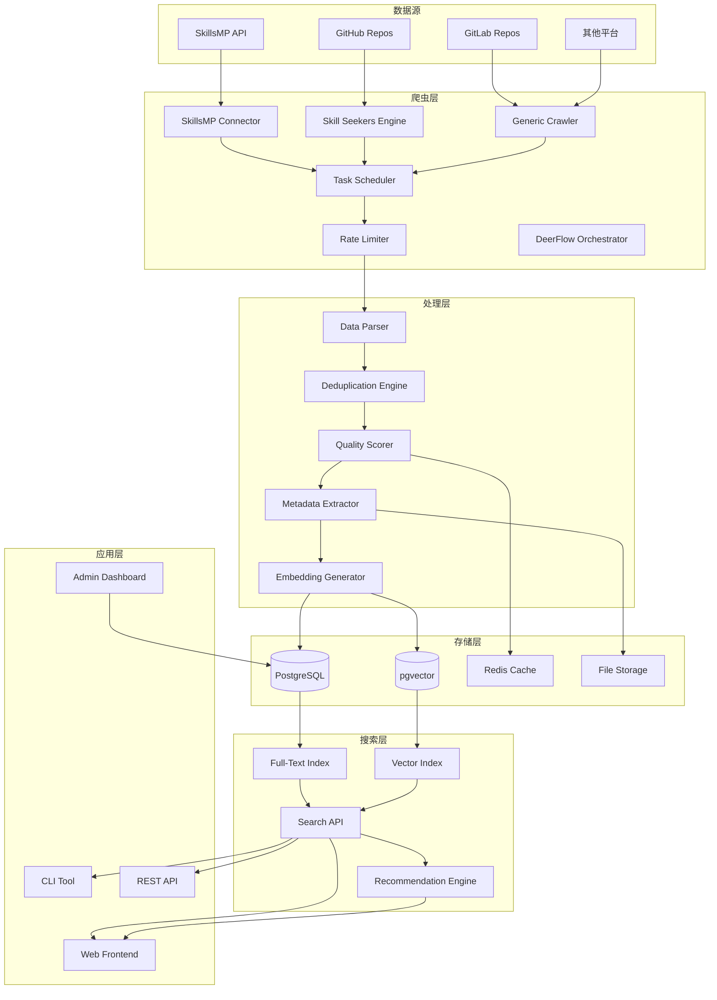
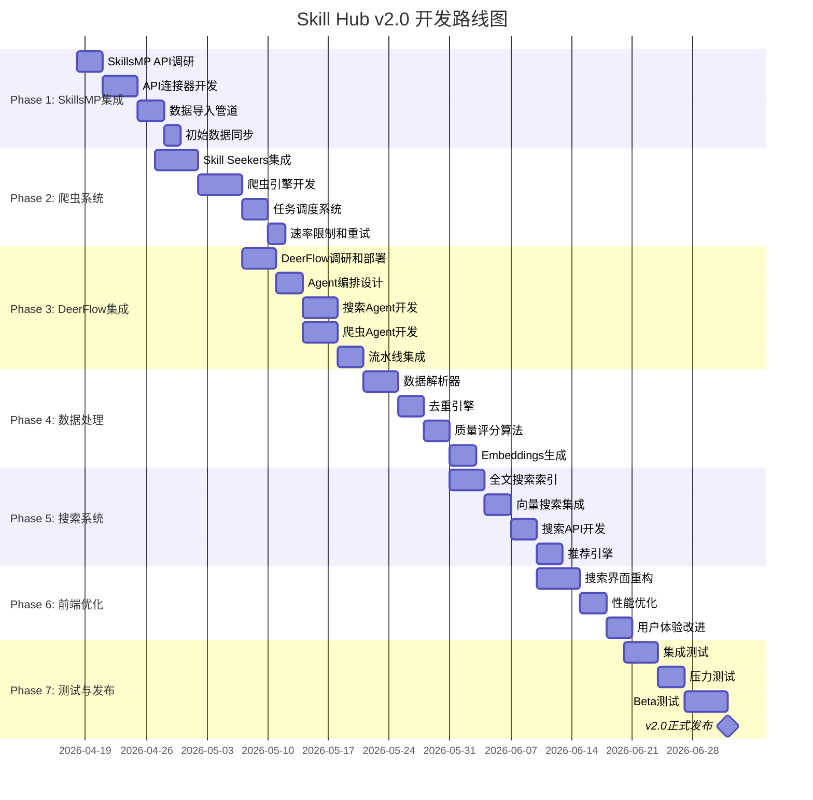
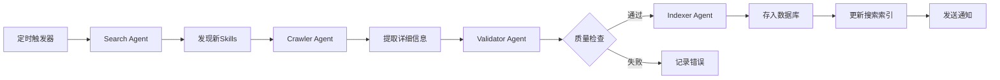

# Skill Hub v2.0 - 全球Skills搜索引擎开发计划

> **项目名称**: Skill Hub - 全球AI Agent Skills搜索引擎
> **版本**: v2.0.0
> **创建日期**: 2026-04-18
> **状态**: 📋 规划阶段
> **核心目标**: 构建面向全球的全面Skills + Agents搜索引擎，集成智能爬虫自动更新

---

## 📋 目录

- [项目背景与愿景](#项目背景与愿景)
- [核心需求分析](#核心需求分析)
- [技术方案设计](#技术方案设计)
- [实施路线图](#实施路线图)
- [详细任务分解](#详细任务分解)
- [数据架构设计](#数据架构设计)
- [爬虫系统设计](#爬虫系统设计)
- [搜索系统架构](#搜索系统架构)
- [性能优化策略](#性能优化策略)
- [风险管理](#风险管理)
- [成功标准](#成功标准)

---

## 项目背景与愿景

### 问题陈述

当前AI Agent生态面临的核心痛点：

1. **信息过载** 🔥
   - GitHub上有数十万个Skill/Agent仓库
   - 开发者难以发现和评估合适的Skills
   - 用户被海量信息淹没，无法快速找到所需

2. **分散化严重** 🌐
   - Skills分布在GitHub、GitLab、私有仓库等多个平台
   - 缺乏统一的索引和搜索入口
   - 每个平台有自己的格式和规范

3. **更新滞后** ⏰
   - 新Skills不断涌现，但发现渠道有限
   - 现有Skills的更新难以及时追踪
   - 缺少自动化的监控和更新机制

### 解决方案愿景

Skill Hub v2.0将打造：

```
┌──────────────────────────────────────────────────────┐
│          Skill Hub v2.0 生态系统                      │
├──────────────────────────────────────────────────────┤
│                                                       │
│  数据源层 (Sources)                                   │
│  ┌──────────┐  ┌──────────┐  ┌──────────┐           │
│  │SkillsMP  │  │GitHub    │  │GitLab等  │           │
│  │(50k+     │  │SKILL.md  │  │其他平台  │           │
│  │ skills)  │  │repos     │  │          │           │
│  └────┬─────┘  └────┬─────┘  └────┬─────┘           │
│       │             │             │                   │
│       └─────────────┼─────────────┘                   │
│                     │                                 │
│  爬虫层 (Crawlers)  ▼                                 │
│  ┌──────────────────────────────────┐                │
│  │  智能爬虫系统                     │                │
│  │  • SkillsMP API集成              │                │
│  │  • Skill Seekers引擎             │                │
│  │  • 定时任务调度                  │                │
│  │  • 增量更新检测                  │                │
│  └──────────────┬───────────────────┘                │
│                 │                                     │
│  索引层 (Index) ▼                                     │
│  ┌──────────────────────────────────┐                │
│  │  统一索引数据库                   │                │
│  │  • 标准化元数据                  │                │
│  │  • 全文搜索引擎                  │                │
│  │  • 向量 embeddings               │                │
│  │  • 关系图谱                      │                │
│  └──────────────┬───────────────────┘                │
│                 │                                     │
│  服务层 (Service) ▼                                   │
│  ┌──────────────────────────────────┐                │
│  │  Skill Hub 核心服务               │                │
│  │  • 搜索API                       │                │
│  │  • 推荐引擎                      │                │
│  │  • 质量评分                      │                │
│  │  • 去重合并                      │                │
│  └──────────────┬───────────────────┘                │
│                 │                                     │
│  应用层 (Application) ▼                               │
│  ┌──────────┐  ┌──────────┐  ┌──────────┐           │
│  │Web前端   │  │CLI工具   │  │API接口   │           │
│  │• 搜索界面│  │• 命令行  │  │• REST    │           │
│  │• 详情页  │  │• 批量操作│  │• GraphQL │           │
│  │• 收藏管理│  │• 自动化  │  │• Webhook │           │
│  └──────────┘  └──────────┘  └──────────┘           │
│                                                       │
└──────────────────────────────────────────────────────┘
```

### 核心价值主张

| 用户群体 | 价值 |
|---------|------|
| **开发者** | 一站式发现全球Skills，避免重复造轮子 |
| **用户** | 快速找到最适合的Agent技能，节省时间 |
| **平台** | 建立Skills数据壁垒，成为行业标准 |
| **社区** | 促进Skills共享和协作，推动生态发展 |

---

## 核心需求分析

### 功能需求

#### FR1: 全球Skills搜索

- **FR1.1**: 支持关键词全文搜索（标题、描述、标签）
- **FR1.2**: 支持多维度筛选（分类、语言、许可证、更新时间）
- **FR1.3**: 支持高级搜索语法（AND/OR/NOT）
- **FR1.4**: 搜索结果排序（相关性、热度、评分、更新时间）
- **FR1.5**: 搜索建议和历史记录

#### FR2: 智能爬虫系统

- **FR2.1**: 集成SkillsMP API获取已有skills数据
- **FR2.2**: 基于Skill Seekers爬取GitHub SKILL.md仓库
- **FR2.3**: 定时任务调度（每日自动更新）
- **FR2.4**: 增量更新检测（只抓取变化的内容）
- **FR2.5**: 去重处理（识别相同skill的不同来源）

#### FR3: 数据标准化

- **FR3.1**: 统一元数据格式（名称、描述、作者、版本等）
- **FR3.2**: 提取关键信息（权限、依赖、兼容性）
- **FR3.3**: 生成摘要和标签
- **FR3.4**: 计算质量评分
- **FR3.5**: 存储下载链接和安装指令

#### FR4: 数据管理

- **FR4.1**: Skills CRUD操作
- **FR4.2**: 来源追踪（记录每个skill的数据源）
- **FR4.3**: 版本历史管理
- **FR4.4**: 失效链接检测和处理
- **FR4.5**: 数据导出功能

#### FR5: 用户体验

- **FR5.1**: 响应式Web界面
- **FR5.2**: 快速加载（<1s首屏）
- **FR5.3**: 收藏和订阅功能
- **FR5.4**: 个性化推荐
- **FR5.5**: 多语言支持

### 非功能需求

#### NFR1: 性能

- 搜索响应时间 P95 < 200ms
- 爬虫并发处理能力 > 100 repos/min
- 支持百万级skills索引
- 日更新量 > 1000 new skills

#### NFR2: 可扩展性

- 水平扩展支持（增加爬虫节点）
- 模块化设计（易于添加新数据源）
- 插件化架构（自定义解析器）

#### NFR3: 可靠性

- 系统可用性 > 99.5%
- 数据一致性保证
- 失败重试机制
- 断点续传支持

#### NFR4: 合规性

- 遵守robots.txt协议
- 尊重GitHub API速率限制
- 数据来源标注清晰
- 支持数据删除请求

---

## 技术方案设计

### 技术栈选型

```yaml
前端框架: Next.js 14 (App Router)
UI组件: MUI 7.x + Tailwind CSS
状态管理: Zustand + React Query

后端API: Next.js API Routes + Server Actions
数据库: PostgreSQL 16 (主数据存储)
搜索引擎: 
  - PostgreSQL Full-Text Search (基础搜索)
  - Meilisearch/Elasticsearch (高级搜索，可选)
向量数据库: pgvector (语义搜索)
缓存: Redis (Upstash)

爬虫系统:
  - Node.js Workers (轻量级爬虫)
  - Puppeteer/Playwright (动态页面渲染)
  - Skill Seekers (核心爬虫引擎)
  - DeerFlow 2.0 (智能Agent调度框架)
  - Bull/BullMQ (任务队列)

定时任务:
  - node-cron (简单调度)
  - Temporal.io (复杂工作流，可选)
  - DeerFlow Orchestrator (多Agent协作)

存储:
  - Supabase Storage (文件存储)
  - Cloudflare CDN (静态资源加速)

部署: Vercel (前端) + Railway/Render (后端服务)
监控: Sentry + Grafana
CI/CD: GitHub Actions
```

### 系统架构



---

## 实施路线图



**总周期**: 约11周 (2.5个月)

---

## 详细任务分解

### Phase 1: SkillsMP集成 (Week 1-2)

#### Week 1: API调研与连接器开发

**Task 1.1: SkillsMP API调研**

- [ ] 研究SkillsMP API文档
- [ ] 测试API端点和响应格式
- [ ] 确定认证方式（API Key/OAuth）
- [ ] 了解速率限制策略
- [ ] 评估数据质量和完整性

**验收标准**:
- API调研报告完成
- 至少获取100个sample skills
- 确定技术可行性

**Task 1.2: API连接器开发**

- [ ] 创建SkillsMPConnector类
- [ ] 实现认证模块
- [ ] 实现分页查询
- [ ] 实现错误处理和重试
- [ ] 编写单元测试

```typescript
// lib/crawlers/SkillsMPConnector.ts

export class SkillsMPConnector {
  private apiKey: string;
  private baseUrl: string = 'https://api.skillsmp.com/v1';
  
  async authenticate(): Promise<void> {
    // 实现认证逻辑
  }
  
  async fetchSkills(params: FetchParams): Promise<Skill[]> {
    // 实现skills获取
  }
  
  async fetchSkillDetail(id: string): Promise<SkillDetail> {
    // 实现详情获取
  }
}
```

**验收标准**:
- 连接器可正常工作
- 测试覆盖率 > 80%
- 错误处理完善

**Task 1.3: 数据导入管道**

- [ ] 设计数据转换层
- [ ] 实现SkillsMP格式到SkillHub格式的映射
- [ ] 实现批量插入逻辑
- [ ] 添加进度跟踪
- [ ] 实现断点续传

**验收标准**:
- 可成功导入1000+ skills
- 数据转换准确率 > 95%
- 导入速度 > 100 skills/min

---

#### Week 2: 初始数据同步

**Task 2.1: 数据库Schema扩展**

- [ ] 添加外部数据源字段
- [ ] 添加来源追踪表
- [ ] 添加同步日志表
- [ ] 创建必要的索引
- [ ] 编写迁移脚本

```sql
-- 扩展skills表
ALTER TABLE skills ADD COLUMN source VARCHAR(50);
ALTER TABLE skills ADD COLUMN source_id VARCHAR(255);
ALTER TABLE skills ADD COLUMN source_url TEXT;
ALTER TABLE skills ADD COLUMN last_synced_at TIMESTAMP;
ALTER TABLE skills ADD COLUMN sync_status VARCHAR(20);

-- 创建同步日志表
CREATE TABLE sync_logs (
  id UUID PRIMARY KEY DEFAULT gen_random_uuid(),
  source VARCHAR(50) NOT NULL,
  started_at TIMESTAMP DEFAULT NOW(),
  completed_at TIMESTAMP,
  total_count INTEGER,
  success_count INTEGER,
  failed_count INTEGER,
  status VARCHAR(20),
  error_message TEXT
);
```

**验收标准**:
- Schema迁移成功
- 索引优化查询性能
- 向后兼容现有数据

**Task 2.2: 初始全量同步**

- [ ] 执行首次全量数据拉取
- [ ] 监控同步进度
- [ ] 处理同步错误
- [ ] 验证数据完整性
- [ ] 生成同步报告

**验收标准**:
- 成功同步SkillsMP所有可用skills
- 数据完整率 > 98%
- 同步日志完整

---

### Phase 2: 爬虫系统 (Week 3-4)

#### Week 3: Skill Seekers集成

**Task 3.1: Skill Seekers调研**

- [ ] 克隆Skill Seekers仓库
- [ ] 分析代码结构和架构
- [ ] 理解爬虫工作原理
- [ ] 评估集成难度
- [ ] 制定集成方案

**参考资源**:
- GitHub: https://github.com/yusufkaraaslan/Skill_Seekers
- 文档: 阅读README和Wiki

**验收标准**:
- 完成技术调研报告
- 确定集成方案
- 识别潜在风险

**Task 3.2: Skill Seekers集成**

- [ ] Fork或clone Skill Seekers
- [ ] 适配SkillHub数据模型
- [ ] 修改输出格式
- [ ] 添加配置选项
- [ ] 测试基本功能

```typescript
// lib/crawlers/SkillSeekersAdapter.ts

export class SkillSeekersAdapter {
  private crawler: any; // Skill Seekers实例
  
  constructor(config: CrawlerConfig) {
    // 初始化Skill Seekers
    this.crawler = new SkillSeekers({
      ...config,
      outputFormat: 'json',
      callback: this.processResult.bind(this)
    });
  }
  
  async crawl(repo: string): Promise<Skill> {
    return new Promise((resolve, reject) => {
      this.crawler.crawl(repo, (error, result) => {
        if (error) reject(error);
        else resolve(this.transform(result));
      });
    });
  }
  
  private transform(raw: any): Skill {
    // 转换为SkillHub格式
    return {
      name: raw.name,
      description: raw.description,
      // ... 其他字段
    };
  }
}
```

**验收标准**:
- 可成功爬取测试仓库
- 数据格式正确
- 性能符合要求

**Task 3.3: 通用爬虫开发**

- [ ] 设计爬虫接口
- [ ] 实现GitHub爬虫
- [ ] 实现GitLab爬虫（可选）
- [ ] 添加代理支持
- [ ] 实现User-Agent轮换

**验收标准**:
- 支持多平台爬取
- 遵守robots.txt
- 速率限制合理

---

#### Week 4: 任务调度系统

**Task 4.1: 任务队列实现**

- [ ] 集成Bull/BullMQ
- [ ] 设计任务类型（全量/增量）
- [ ] 实现优先级队列
- [ ] 添加任务监控
- [ ] 实现失败重试

```typescript
// lib/queue/CrawlerQueue.ts

import { Queue, Worker } from 'bullmq';

export class CrawlerQueue {
  private queue: Queue;
  private worker: Worker;
  
  constructor() {
    this.queue = new Queue('crawler-tasks', {
      connection: redisConnection
    });
    
    this.worker = new Worker('crawler-tasks', this.processTask.bind(this), {
      connection: redisConnection,
      concurrency: 10
    });
  }
  
  async addCrawlTask(repo: string, priority: number = 1) {
    await this.queue.add('crawl', { repo }, {
      priority,
      attempts: 3,
      backoff: { type: 'exponential', delay: 2000 }
    });
  }
  
  private async processTask(job: Job) {
    const { repo } = job.data;
    // 执行爬取逻辑
  }
}
```

**验收标准**:
- 任务队列稳定运行
- 支持并发处理
- 重试机制有效

**Task 4.2: 定时调度器**

- [ ] 配置cron表达式
- [ ] 实现每日自动爬取
- [ ] 实现增量更新检测
- [ ] 添加手动触发接口
- [ ] 实现调度监控面板

**验收标准**:
- 定时任务准时执行
- 增量更新准确
- 监控数据完整

**Task 4.3: 速率限制和反爬策略**

- [ ] 实现Token Bucket限流
- [ ] 配置GitHub API速率限制
- [ ] 实现IP轮换（可选）
- [ ] 添加请求延迟
- [ ] 监控API配额使用

**验收标准**:
- 不违反API限制
- 被封禁风险低
- 爬取效率合理

---

### Phase 3: DeerFlow 2.0集成 (Week 5-7)

#### Week 5: DeerFlow调研和部署

**Task 3.1: DeerFlow调研**

- [ ] 研究DeerFlow 2.0架构和核心概念
- [ ] 理解Sub-Agent编排机制
- [ ] 分析内置搜索和爬虫工具
- [ ] 评估与SkillHub集成的可行性
- [ ] 制定集成方案

**DeerFlow 2.0核心特性**:
- 🦌 **SuperAgent Harness**: 多Agent协作编排平台
- 🔧 **可插拔技能**: 扩展Agent能力
- 🧠 **Memory持久化**: 长期记忆和上下文管理
- 🛡️ **沙盒隔离**: 安全的代码执行环境
- 🔍 **内置搜索**: Tavily、InfoQuest等搜索引擎
- 🕷️ **爬虫工具**: 网页抓取和内容提取
- 📊 **流式响应**: 实时任务进度反馈

**验收标准**:
- 完成DeerFlow技术调研报告
- 确定集成架构设计
- 识别潜在风险和挑战

**Task 3.2: DeerFlow部署**

- [ ] Clone DeerFlow仓库
- [ ] 配置Docker环境
- [ ] 设置API Keys (Tavily, OpenAI等)
- [ ] 启动DeerFlow服务
- [ ] 测试基本功能

```bash
# 克隆DeerFlow
git clone https://github.com/bytedance/deer-flow.git
cd deer-flow

# 生成配置文件
make config

# 编辑config.yaml，配置模型和API Keys
# models:
#   - name: gpt-4
#     api_key: $OPENAI_API_KEY
# 
# env:
#   TAVILY_API_KEY: your-tavily-key
#   INFOQUEST_API_KEY: your-infoquest-key

# Docker方式启动（推荐）
make docker-init
make docker-start

# 访问 http://localhost:2026
```

**验收标准**:
- DeerFlow服务正常运行
- 可以成功执行示例任务
- API接口可访问

---

#### Week 6: Agent编排设计

**Task 3.3: 设计Agent工作流**

- [ ] 定义Search Agent（搜索专家）
- [ ] 定义Crawler Agent（爬虫专家）
- [ ] 定义Validator Agent（验证专家）
- [ ] 定义Indexer Agent（索引专家）
- [ ] 设计Agent协作流程

**Agent角色定义**:

```yaml
# deerflow/config/skillhub_agents.yaml

agents:
  search_agent:
    role: "Search Specialist"
    goal: "Discover and find AI Agent Skills from multiple sources"
    tools:
      - tavily_search
      - github_search
      - skillsmp_api
    instructions: |
      You are an expert at finding AI Agent Skills.
      Search across GitHub, SkillsMP, and other platforms.
      Return structured results with metadata.

  crawler_agent:
    role: "Crawling Specialist"
    goal: "Extract detailed information from Skill repositories"
    tools:
      - web_scraper
      - file_reader
      - markdown_parser
    instructions: |
      You are an expert at crawling and parsing Skill repositories.
      Extract SKILL.md content, dependencies, and metadata.
      Validate the structure and completeness.

  validator_agent:
    role: "Quality Assurance Specialist"
    goal: "Validate and score Skill quality"
    tools:
      - code_analyzer
      - security_scanner
      - quality_scorer
    instructions: |
      You are an expert at evaluating Skill quality.
      Check for completeness, security, and best practices.
      Assign a quality score and provide feedback.

  indexer_agent:
    role: "Indexing Specialist"
    goal: "Prepare Skills for search indexing"
    tools:
      - embedding_generator
      - metadata_extractor
      - database_writer
    instructions: |
      You are an expert at preparing data for search.
      Generate embeddings, extract keywords, and index in database.
```

**验收标准**:
- Agent角色定义清晰
- 工具配置完整
- 协作流程合理

**Task 3.4: 创建自定义Skills**

- [ ] 开发SkillHub Search Skill
- [ ] 开发SkillHub Crawler Skill
- [ ] 开发SkillHub Validator Skill
- [ ] 开发SkillHub Indexer Skill
- [ ] 测试Skills功能

```typescript
// deerflow/skills/skillhub-search.ts

import { Skill } from '@deerflow/core';

export const skillhubSearchSkill: Skill = {
  name: 'skillhub-search',
  description: 'Search for AI Agent Skills across multiple sources',
  version: '1.0.0',
  
  parameters: {
    query: { type: 'string', required: true },
    sources: { type: 'array', default: ['github', 'skillsmp'] },
    limit: { type: 'number', default: 20 },
  },
  
  async execute(params) {
    const { query, sources, limit } = params;
    const results = [];
    
    // Search GitHub
    if (sources.includes('github')) {
      const githubResults = await searchGitHub(query, limit);
      results.push(...githubResults);
    }
    
    // Search SkillsMP
    if (sources.includes('skillsmp')) {
      const skillsmpResults = await searchSkillsMP(query, limit);
      results.push(...skillsmpResults);
    }
    
    // Deduplicate and rank
    const unique = deduplicate(results);
    const ranked = rankByRelevance(unique, query);
    
    return {
      skills: ranked.slice(0, limit),
      total: unique.length,
      sources,
    };
  },
};
```

**验收标准**:
- Skills可正常加载
- 执行结果正确
- 错误处理完善

---

#### Week 7: 流水线集成

**Task 3.5: 构建自动化流水线**

- [ ] 设计Discovery Pipeline
- [ ] 实现定时触发器
- [ ] 配置Agent编排
- [ ] 添加监控和日志
- [ ] 实现失败重试

**流水线架构**:



**实现代码**:

```typescript
// lib/deerflow/SkillDiscoveryPipeline.ts

import { DeerFlowClient } from '@deerflow/client';

export class SkillDiscoveryPipeline {
  private client: DeerFlowClient;
  
  constructor() {
    this.client = new DeerFlowClient({
      baseUrl: process.env.DEERFLOW_URL || 'http://localhost:2026',
      apiKey: process.env.DEERFLOW_API_KEY,
    });
  }
  
  /**
   * 执行完整的发现流水线
   */
  async runDiscovery(): Promise<DiscoveryResult> {
    console.log('Starting Skill discovery pipeline...');
    
    // Step 1: Search Agent发现新Skills
    const searchResult = await this.client.executeAgent('search_agent', {
      query: 'AI Agent SKILL.md',
      sources: ['github', 'skillsmp'],
      limit: 100,
    });
    
    console.log(`Found ${searchResult.skills.length} candidate skills`);
    
    // Step 2: 并行处理每个Skill
    const processedSkills = await Promise.allSettled(
      searchResult.skills.map(skill => this.processSkill(skill))
    );
    
    // Step 3: 统计结果
    const success = processedSkills.filter(r => r.status === 'fulfilled').length;
    const failed = processedSkills.filter(r => r.status === 'rejected').length;
    
    console.log(`Pipeline completed: ${success} success, ${failed} failed`);
    
    return {
      total: searchResult.skills.length,
      success,
      failed,
      timestamp: new Date(),
    };
  }
  
  /**
   * 处理单个Skill
   */
  private async processSkill(skill: CandidateSkill): Promise<void> {
    try {
      // Crawler Agent提取详细信息
      const crawled = await this.client.executeAgent('crawler_agent', {
        repository_url: skill.repository_url,
      });
      
      // Validator Agent验证质量
      const validated = await this.client.executeAgent('validator_agent', {
        skill_data: crawled,
      });
      
      if (validated.quality_score < 60) {
        throw new Error(`Low quality score: ${validated.quality_score}`);
      }
      
      // Indexer Agent建立索引
      await this.client.executeAgent('indexer_agent', {
        skill_data: validated,
      });
      
      console.log(`Successfully processed: ${skill.name}`);
    } catch (error) {
      console.error(`Failed to process ${skill.name}:`, error);
      throw error;
    }
  }
  
  /**
   * 配置定时任务
   */
  setupSchedule(cronExpression: string = '0 3 * * *') {
    cron.schedule(cronExpression, async () => {
      console.log('Running scheduled discovery pipeline...');
      try {
        await this.runDiscovery();
      } catch (error) {
        console.error('Scheduled pipeline failed:', error);
        // 发送告警
        await this.sendAlert(error);
      }
    });
    
    console.log(`Discovery pipeline scheduled: ${cronExpression}`);
  }
}
```

**验收标准**:
- 流水线可完整运行
- 定时任务正常工作
- 错误处理和重试有效
- 监控数据完整

**Task 3.6: 监控和告警**

- [ ] 集成Prometheus监控
- [ ] 配置Grafana仪表板
- [ ] 设置告警规则
- [ ] 实现日志聚合
- [ ] 添加性能追踪

**验收标准**:
- 关键指标可监控
- 异常情况及时告警
- 日志查询方便

---

### Phase 4: 数据处理 (Week 8-9)

#### Week 5: 数据解析与去重

**Task 5.1: 数据解析器**

- [ ] 实现SKILL.md解析器
- [ ] 实现package.json解析器
- [ ] 提取元数据（名称、描述、版本）
- [ ] 提取权限声明
- [ ] 提取依赖列表

```typescript
// lib/parsers/SkillParser.ts

export class SkillParser {
  async parseMarkdown(content: string): Promise<SkillMetadata> {
    // 解析SKILL.md frontmatter
    const matter = grayMatter(content);
    return {
      name: matter.data.name,
      description: matter.data.description,
      version: matter.data.version,
      // ...
    };
  }
  
  async parsePackageJson(content: string): Promise<SkillDependencies> {
    const pkg = JSON.parse(content);
    return {
      dependencies: pkg.dependencies || {},
      peerDependencies: pkg.peerDependencies || {},
    };
  }
}
```

**验收标准**:
- 解析准确率 > 95%
- 支持多种格式
- 错误容忍度高

**Task 5.2: 去重引擎**

- [ ] 设计去重算法
- [ ] 实现基于名称的去重
- [ ] 实现基于内容的去重
- [ ] 实现相似度检测
- [ ] 合并重复记录

**去重策略**:
1. **精确匹配**: 名称 + 作者完全相同
2. **模糊匹配**: Levenshtein距离 < 阈值
3. **内容相似**: embedding余弦相似度 > 0.9

**验收标准**:
- 去重准确率 > 90%
- 误判率 < 5%
- 性能可接受

---

#### Week 6: 质量评分与Embeddings

**Task 6.1: 质量评分算法**

- [ ] 设计评分维度
  - 文档完整性 (30%)
  - 代码质量 (25%)
  - 活跃度 (20%)
  - 社区反馈 (15%)
  - 安全性 (10%)
- [ ] 实现评分计算
- [ ] 配置权重参数
- [ ] 测试评分合理性
- [ ] 添加评分解释

```typescript
// lib/scoring/QualityScorer.ts

export class QualityScorer {
  calculate(skill: Skill): number {
    const docScore = this.scoreDocumentation(skill);
    const codeScore = this.scoreCodeQuality(skill);
    const activityScore = this.scoreActivity(skill);
    const communityScore = this.scoreCommunity(skill);
    const securityScore = this.scoreSecurity(skill);
    
    return (
      docScore * 0.3 +
      codeScore * 0.25 +
      activityScore * 0.2 +
      communityScore * 0.15 +
      securityScore * 0.1
    );
  }
}
```

**验收标准**:
- 评分分布合理
- 高分skills确实优质
- 计算速度快

**Task 6.2: Embeddings生成**

- [ ] 选择embedding模型（OpenAI/本地）
- [ ] 实现文本向量化
- [ ] 存储到pgvector
- [ ] 优化向量索引
- [ ] 测试语义搜索效果

**验收标准**:
- embedding质量高
- 搜索相关性好
- 存储成本可控

---

### Phase 4: 搜索系统 (Week 7-8)

#### Week 7: 全文搜索与向量搜索

**Task 7.1: PostgreSQL全文搜索**

- [ ] 配置tsvector索引
- [ ] 实现中文分词（可选）
- [ ] 优化搜索查询
- [ ] 添加高亮显示
- [ ] 测试搜索性能

```sql
-- 创建全文搜索索引
CREATE INDEX idx_skills_search ON skills 
USING GIN(to_tsvector('english', name || ' ' || description));

-- 搜索查询
SELECT *, ts_rank(to_tsvector('english', name || ' ' || description), 
       query) AS rank
FROM skills, to_tsquery('english', 'inventory management') AS query
WHERE to_tsvector('english', name || ' ' || description) @@ query
ORDER BY rank DESC
LIMIT 20;
```

**验收标准**:
- 搜索响应 < 100ms
- 相关性排序准确
- 支持复杂查询

**Task 7.2: 向量搜索集成**

- [ ] 配置pgvector扩展
- [ ] 创建向量索引
- [ ] 实现语义搜索API
- [ ] 混合搜索策略（关键词+向量）
- [ ] 优化召回率

**验收标准**:
- 语义搜索效果好
- 混合搜索提升明显
- 索引构建速度快

---

#### Week 8: 搜索API与推荐引擎

**Task 8.1: 搜索API开发**

- [ ] 设计RESTful API
- [ ] 实现搜索端点
- [ ] 实现过滤和排序
- [ ] 添加分页支持
- [ ] 实现搜索建议

```typescript
// app/api/search/route.ts

export async function GET(request: Request) {
  const { searchParams } = new URL(request.url);
  const query = searchParams.get('q');
  const filters = {
    category: searchParams.get('category'),
    language: searchParams.get('language'),
    minScore: searchParams.get('minScore'),
  };
  
  const results = await searchService.search(query, filters);
  return Response.json(results);
}
```

**验收标准**:
- API响应 < 200ms
- 支持复杂过滤
- 错误处理完善

**Task 8.2: 推荐引擎**

- [ ] 基于协同过滤
- [ ] 基于内容推荐
- [ ] 热门skills推荐
- [ ] 个性化推荐（登录用户）
- [ ] A/B测试框架

**验收标准**:
- 推荐相关性强
- 点击率提升
- 算法可解释

---

### Phase 5: 前端优化 (Week 9)

#### Week 9: 搜索界面与性能

**Task 9.1: 搜索界面重构**

- [ ] 设计新搜索页面
- [ ] 实现实时搜索
- [ ] 添加高级筛选面板
- [ ] 优化结果展示
- [ ] 添加骨架屏

**验收标准**:
- UI美观易用
- 交互流畅
- 移动端适配良好

**Task 9.2: 性能优化**

- [ ] 代码分割
- [ ] 图片懒加载
- [ ] API响应缓存
- [ ] CDN配置
- [ ] Lighthouse优化

**验收标准**:
- 首屏加载 < 1.5s
- Lighthouse > 90
- Core Web Vitals全绿

---

### Phase 6: 测试与发布 (Week 10-11)

#### Week 10-11: 测试与Beta

**Task 10.1: 集成测试**

- [ ] 端到端测试
- [ ] 爬虫稳定性测试
- [ ] 搜索准确性测试
- [ ] 性能基准测试
- [ ] 安全审计

**验收标准**:
- 无P0/P1级别Bug
- 性能达标
- 安全无漏洞

**Task 10.2: Beta测试**

- [ ] 邀请50个测试用户
- [ ] 收集反馈意见
- [ ] Bug修复
- [ ] 用户体验优化
- [ ] 文档完善

**验收标准**:
- 用户满意度 > 85%
- 系统稳定运行7天
- 准备好正式发布

---

## 数据架构设计

### 数据库Schema

```sql
-- 扩展的skills表
CREATE TABLE skills (
  id UUID PRIMARY KEY DEFAULT gen_random_uuid(),
  
  -- 基本信息
  name VARCHAR(255) NOT NULL,
  slug VARCHAR(255) UNIQUE NOT NULL,
  description TEXT,
  version VARCHAR(50),
  
  -- 来源信息
  source VARCHAR(50) NOT NULL, -- 'skillsmp', 'github', 'gitlab', etc.
  source_id VARCHAR(255), -- 原始平台的ID
  source_url TEXT,
  
  -- 作者信息
  author_name VARCHAR(255),
  author_url TEXT,
  
  -- 分类和标签
  category VARCHAR(100),
  tags TEXT[],
  languages TEXT[],
  
  -- 质量指标
  quality_score FLOAT DEFAULT 0,
  download_count INTEGER DEFAULT 0,
  star_count INTEGER DEFAULT 0,
  
  -- 技术信息
  permissions JSONB,
  dependencies JSONB,
  compatibility JSONB,
  
  -- 文件信息
  package_url TEXT,
  documentation_url TEXT,
  repository_url TEXT,
  
  -- 向量嵌入
  embedding vector(1536), -- OpenAI embedding维度
  
  -- 同步信息
  last_synced_at TIMESTAMP,
  sync_status VARCHAR(20),
  
  -- 时间戳
  created_at TIMESTAMP DEFAULT NOW(),
  updated_at TIMESTAMP DEFAULT NOW()
);

-- 同步日志表
CREATE TABLE sync_logs (
  id UUID PRIMARY KEY DEFAULT gen_random_uuid(),
  source VARCHAR(50) NOT NULL,
  started_at TIMESTAMP DEFAULT NOW(),
  completed_at TIMESTAMP,
  total_count INTEGER,
  success_count INTEGER,
  failed_count INTEGER,
  status VARCHAR(20),
  error_message TEXT,
  metadata JSONB
);

-- 爬虫任务队列
CREATE TABLE crawler_tasks (
  id UUID PRIMARY KEY DEFAULT gen_random_uuid(),
  task_type VARCHAR(50) NOT NULL, -- 'full_sync', 'incremental', 'single_repo'
  target VARCHAR(255), -- repo URL or ID
  status VARCHAR(20) DEFAULT 'pending',
  priority INTEGER DEFAULT 1,
  retry_count INTEGER DEFAULT 0,
  max_retries INTEGER DEFAULT 3,
  scheduled_at TIMESTAMP,
  started_at TIMESTAMP,
  completed_at TIMESTAMP,
  error_message TEXT,
  result JSONB
);

-- 索引
CREATE INDEX idx_skills_source ON skills(source);
CREATE INDEX idx_skills_quality ON skills(quality_score DESC);
CREATE INDEX idx_skills_updated ON skills(updated_at DESC);
CREATE INDEX idx_skills_embedding ON skills USING ivfflat (embedding vector_cosine_ops);
CREATE INDEX idx_crawler_tasks_status ON crawler_tasks(status);
```

---

## 爬虫系统设计

### 爬虫架构

```
┌─────────────────────────────────────────┐
│         Crawler Orchestrator            │
├─────────────────────────────────────────┤
│                                         │
│  ┌──────────┐  ┌──────────┐            │
│  │Scheduler │  │Monitor   │            │
│  └────┬─────┘  └────┬─────┘            │
│       │             │                   │
│       └──────┬──────┘                   │
│              │                          │
│  ┌───────────▼───────────┐             │
│  │   Task Queue (Redis)  │             │
│  └───────────┬───────────┘             │
│              │                          │
│  ┌───────────▼───────────┐             │
│  │   Worker Pool         │             │
│  │  ┌────┐ ┌────┐ ┌────┐│             │
│  │  │W1  │ │W2  │ │Wn  ││             │
│  │  └────┘ └────┘ └────┘│             │
│  └───────────┬───────────┘             │
│              │                          │
│  ┌───────────▼───────────┐             │
│  │   Rate Limiter        │             │
│  └───────────┬───────────┘             │
│              │                          │
└──────────────┼──────────────────────────┘
               │
    ┌──────────┼──────────┐
    │          │          │
    ▼          ▼          ▼
 ┌──────┐  ┌──────┐  ┌──────┐
 │Skills│  │GitHub│  │GitLab│
 │ MP   │  │      │  │      │
 └──────┘  └──────┘  └──────┘
```

### 爬虫配置

```typescript
// config/crawler.config.ts

export const crawlerConfig = {
  // SkillsMP配置
  skillsmp: {
    apiUrl: 'https://api.skillsmp.com/v1',
    apiKey: process.env.SKILLSMP_API_KEY,
    rateLimit: 100, // requests per minute
    batchSize: 50,
  },
  
  // GitHub配置
  github: {
    token: process.env.GITHUB_TOKEN,
    rateLimit: 5000, // requests per hour
    concurrentRepos: 10,
    delayBetweenRequests: 1000, // ms
  },
  
  // 通用配置
  general: {
    timeout: 30000, // 30s
    maxRetries: 3,
    retryDelay: 2000, // 2s
    userAgent: 'SkillHub-Crawler/2.0',
  },
  
  // 调度配置
  schedule: {
    fullSync: '0 2 * * 0', // 每周日凌晨2点
    incrementalSync: '0 3 * * *', // 每天凌晨3点
    healthCheck: '*/30 * * * *', // 每30分钟
  },
};
```

---

## 搜索系统架构

### 混合搜索策略

```typescript
// lib/search/HybridSearchEngine.ts

export class HybridSearchEngine {
  async search(query: string, options: SearchOptions): Promise<SearchResult> {
    // 1. 关键词搜索
    const keywordResults = await this.keywordSearch(query, options);
    
    // 2. 向量搜索（如果启用）
    let vectorResults = [];
    if (options.enableSemantic) {
      const embedding = await this.generateEmbedding(query);
      vectorResults = await this.vectorSearch(embedding, options);
    }
    
    // 3. 融合结果
    const merged = this.mergeResults(keywordResults, vectorResults, {
      keywordWeight: 0.6,
      vectorWeight: 0.4,
    });
    
    // 4. 应用过滤和排序
    const filtered = this.applyFilters(merged, options.filters);
    const sorted = this.applySorting(filtered, options.sortBy);
    
    // 5. 分页
    const paginated = this.paginate(sorted, options.page, options.pageSize);
    
    return {
      results: paginated,
      total: sorted.length,
      page: options.page,
      pageSize: options.pageSize,
    };
  }
}
```

---

## 性能优化策略

### 1. 爬虫优化

- **并发控制**: 限制同时爬取的仓库数量
- **增量更新**: 只爬取有变化的内容
- **缓存策略**: 缓存已处理的仓库元数据
- **批量处理**: 批量插入数据库减少I/O

### 2. 搜索优化

- **索引优化**: 定期重建和优化索引
- **查询缓存**: 缓存热门搜索查询
- **分页优化**: 使用游标分页代替OFFSET
- **预计算**: 预计算质量评分和排名

### 3. 前端优化

- **SSR/ISR**: 使用Next.js的服务端渲染
- **图片优化**: WebP格式 + CDN
- **代码分割**: 按需加载组件
- **Service Worker**: 离线缓存

---

## 风险管理

### 技术风险

| 风险 | 概率 | 影响 | 缓解措施 |
|------|------|------|----------|
| SkillsMP API不稳定 | 中 | 高 | 实现降级策略，缓存数据 |
| GitHub速率限制 | 高 | 中 | 多Token轮换，智能调度 |
| 数据质量问题 | 中 | 中 | 多重验证，人工审核 |
| 搜索引擎性能瓶颈 | 低 | 高 | 水平扩展，读写分离 |

### 业务风险

| 风险 | 概率 | 影响 | 缓解措施 |
|------|------|------|----------|
| 数据源停止服务 | 低 | 高 | 多数据源备份 |
| 法律合规问题 | 低 | 极高 | 法律顾问审查 |
| 用户增长缓慢 | 中 | 中 | SEO优化，社区运营 |

---

## 成功标准

### 技术指标

- ✅ 索引skills数量 > 50,000
- ✅ 搜索响应时间 P95 < 200ms
- ✅ 爬虫日处理能力 > 1,000 repos
- ✅ 数据更新延迟 < 24小时
- ✅ 系统可用性 > 99.5%

### 产品指标

- ✅ 月活跃用户 > 1,000
- ✅ 搜索转化率 > 30%
- ✅ 用户满意度 > 85%
- ✅ 数据准确率 > 95%

### 业务指标

- ✅ 成为主流Skills发现平台
- ✅ 建立行业标准地位
- ✅ 为ProClaw生态引流

---

## 下一步行动

### 立即执行（本周）

- [ ] 注册SkillsMP账号并获取API Key
- [ ] Fork Skill Seekers仓库
- [ ] 搭建开发环境
- [ ] 开始Task 1.1: SkillsMP API调研

---

**文档版本**: v1.0  
**创建日期**: 2026-04-18  
**最后更新**: 2026-04-18  
**审批状态**: 待审批

---

_Skill Hub v2.0将通过集成SkillsMP和Skill Seekers，打造全球领先的AI Agent Skills搜索引擎，解决信息过载问题，为开发者和用户提供一站式的Skills发现和管理平台。_
