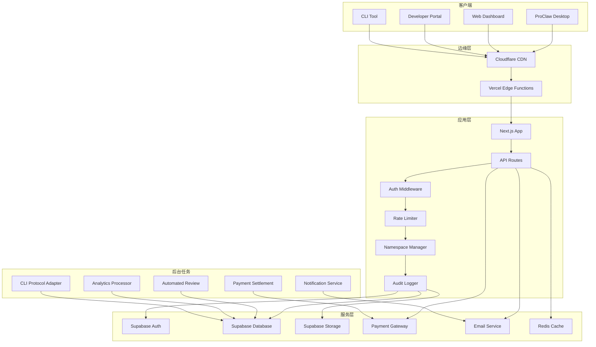
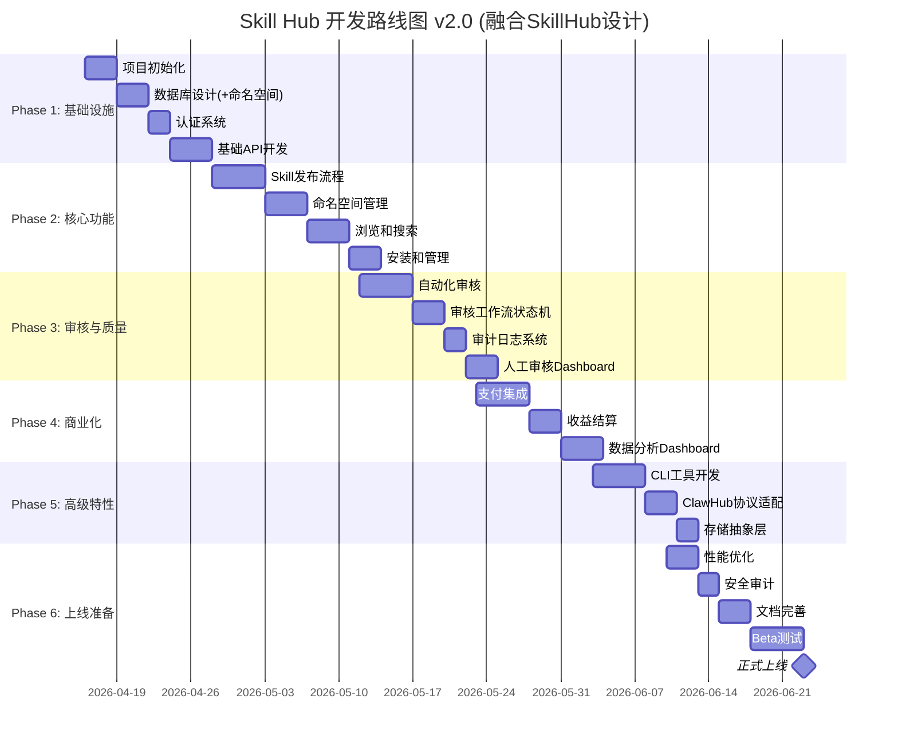

# Skill Hub 项目开发计划 v2.0 (增强版)

> **项目名称**: Skill Hub - ProClaw AI技能市场平台
> **项目地址**: https://skillhub.proclaw.cc
> **版本**: v2.0.0 (融合SkillHub优秀设计)
> **创建日期**: 2026-04-16
> **更新日期**: 2026-04-16
> **预计周期**: 8周 (2个月)
> **状态**: 📋 规划阶段
> **参考项目**: iflytek/SkillHub (Apache 2.0)

---

## 📋 目录

- [项目概述](#项目概述)
- [核心目标](#核心目标)
- [技术架构](#技术架构)
- [SkillHub优秀设计融合](#skillhub优秀设计融合)
- [实施路线图](#实施路线图)
- [详细任务分解](#详细任务分解)
- [关键里程碑](#关键里程碑)
- [风险管理](#风险管理)
- [资源需求](#资源需求)
- [成功标准](#成功标准)

---

## 项目概述

### 背景

Skill Hub是ProClaw生态系统的核心组成部分，为AI技能开发者提供发布、管理和变现技能的平台。本计划在原有基础上**融合了iflytek/SkillHub的优秀设计理念**，包括命名空间管理、审核工作流、CLI兼容性等企业级特性。

### 定位

```
┌─────────────────────────────────────────────┐
│         Skill Hub 生态系统 (v2.0)            │
├─────────────────────────────────────────────┤
│                                             │
│  开发者端              用户端                │
│  ┌──────────┐       ┌──────────┐           │
│  │ 发布技能  │──────▶│ 浏览搜索  │           │
│  │ 命名空间  │       │ 一键安装  │           │
│  │ 版本管理  │       │ 评价反馈  │           │
│  │ 获得收益  │◀──────│ 付费订阅  │           │
│  └──────────┘       └──────────┘           │
│                                             │
│  平台端 (融合SkillHub设计)                   │
│  ┌──────────────────────────┐              │
│  │ • 自动化审核 + 人工复核   │              │
│  │ • 命名空间治理            │              │
│  │ • 审计日志追踪            │              │
│  │ • CLI协议兼容             │              │
│  │ • 数据分析 + 收益结算     │              │
│  └──────────────────────────┘              │
└─────────────────────────────────────────────┘
```

### 核心价值

| 角色       | 价值主张                                               |
| ---------- | ------------------------------------------------------ |
| **开发者** | 低门槛发布、公平分成、技术支持、社区曝光、团队命名空间 |
| **用户**   | 丰富选择、质量保证、一键安装、持续更新、CLI便捷使用    |
| **平台**   | 生态壁垒、收入来源、数据积累、品牌效应、企业级治理     |

---

## 核心目标

### 业务目标

- ✅ 8周内上线MVP版本
- ✅ 首批入驻50+优质Skills
- ✅ 吸引100+活跃开发者
- ✅ 实现月收入¥10,000+
- ✅ 支持团队/个人命名空间

### 技术目标

- ✅ 高可用架构 (99.9% uptime)
- ✅ 快速响应 (API P95 < 200ms)
- ✅ 安全合规 (自动化审核 + 人工复核 + 审计日志)
- ✅ 可扩展设计 (支持未来Plugin Hub复用)
- ✅ CLI协议兼容 (ClawHub兼容)

### 产品目标

- ✅ 简洁易用的开发者体验
- ✅ 流畅的用户浏览和安装流程
- ✅ 完善的审核和质量保障机制
- ✅ 透明的数据分析和收益展示
- ✅ 企业级命名空间和权限管理

---

## 技术架构

### 技术栈选型

```yaml
前端框架: Next.js 14 (App Router)
UI组件: MUI 7.x + Tailwind CSS
状态管理: Zustand + React Query
后端API: Next.js API Routes + Server Actions
数据库: Supabase PostgreSQL
存储: Supabase Storage + Cloudflare CDN
认证: Supabase Auth + NextAuth
缓存: Redis (Upstash)
支付: 支付宝 + 微信支付 (后续扩展Stripe)
部署: Vercel
监控: Sentry + Grafana
CI/CD: GitHub Actions
CLI工具: Node.js CLI (兼容ClawHub协议)
```

### 系统架构图 (融合SkillHub设计)



---

## SkillHub优秀设计融合

### 1. 命名空间管理系统 ⭐⭐⭐⭐⭐

**借鉴自**: iflytek/SkillHub的Team Namespaces设计

#### 设计要点

```typescript
// types/namespace.ts

export enum NamespaceType {
  PERSONAL = 'personal', // 个人空间
  TEAM = 'team', // 团队空间
  GLOBAL = 'global', // 全局公开空间
}

export enum NamespaceRole {
  OWNER = 'owner', // 所有者（完全控制）
  ADMIN = 'admin', // 管理员（可审核、管理成员）
  MEMBER = 'member', // 成员（可发布技能）
  VIEWER = 'viewer', // 观察者（仅查看）
}

export interface Namespace {
  id: string;
  name: string;
  slug: string; // URL友好的标识符
  type: NamespaceType;
  description?: string;
  avatar_url?: string;

  // 权限配置
  visibility: 'public' | 'private';
  allow_public_publish: boolean; // 是否允许公开发布

  // 统计
  skill_count: number;
  member_count: number;
  download_count: number;

  created_at: string;
  updated_at: string;
  owner_id: string;
}

export interface NamespaceMember {
  namespace_id: string;
  user_id: string;
  role: NamespaceRole;
  invited_by: string;
  joined_at: string;
}

export interface PublishingPolicy {
  require_review: boolean; // 是否需要审核
  auto_approve_members: boolean; // 成员发布是否自动通过
  allowed_versions: string[]; // 允许的版本格式
  max_package_size_mb: number; // 最大包大小
}
```

#### 数据库Schema

```sql
-- 命名空间表
CREATE TABLE namespaces (
  id UUID PRIMARY KEY DEFAULT gen_random_uuid(),
  name VARCHAR(255) NOT NULL,
  slug VARCHAR(255) UNIQUE NOT NULL,
  type VARCHAR(50) NOT NULL CHECK (type IN ('personal', 'team', 'global')),
  description TEXT,
  avatar_url TEXT,

  visibility VARCHAR(50) DEFAULT 'public' CHECK (visibility IN ('public', 'private')),
  allow_public_publish BOOLEAN DEFAULT false,

  owner_id UUID REFERENCES auth.users(id),

  skill_count INTEGER DEFAULT 0,
  member_count INTEGER DEFAULT 1,
  download_count INTEGER DEFAULT 0,

  created_at TIMESTAMP WITH TIME ZONE DEFAULT NOW(),
  updated_at TIMESTAMP WITH TIME ZONE DEFAULT NOW()
);

-- 命名空间成员表
CREATE TABLE namespace_members (
  namespace_id UUID REFERENCES namespaces(id) ON DELETE CASCADE,
  user_id UUID REFERENCES auth.users(id) ON DELETE CASCADE,
  role VARCHAR(50) NOT NULL CHECK (role IN ('owner', 'admin', 'member', 'viewer')),
  invited_by UUID REFERENCES auth.users(id),
  joined_at TIMESTAMP WITH TIME ZONE DEFAULT NOW(),

  PRIMARY KEY (namespace_id, user_id)
);

-- 发布策略表
CREATE TABLE namespace_policies (
  namespace_id UUID PRIMARY KEY REFERENCES namespaces(id) ON DELETE CASCADE,
  require_review BOOLEAN DEFAULT true,
  auto_approve_members BOOLEAN DEFAULT false,
  allowed_versions TEXT[] DEFAULT ARRAY['*'],
  max_package_size_mb INTEGER DEFAULT 50,
  updated_at TIMESTAMP WITH TIME ZONE DEFAULT NOW()
);

-- 索引
CREATE INDEX idx_namespaces_slug ON namespaces(slug);
CREATE INDEX idx_namespaces_owner ON namespaces(owner_id);
CREATE INDEX idx_namespace_members_user ON namespace_members(user_id);
```

#### UI设计要点

```tsx
// components/NamespaceSelector.tsx

export default function NamespaceSelector({
  onSelect,
  currentNamespace,
}: NamespaceSelectorProps) {
  const { namespaces } = useNamespaces();

  return (
    <Menu>
      <MenuItem onClick={() => onSelect('personal')}>
        <PersonIcon /> 个人空间
      </MenuItem>

      <Divider />

      {namespaces.teams.map(team => (
        <MenuItem key={team.id} onClick={() => onSelect(team.slug)}>
          <GroupIcon /> {team.name}
        </MenuItem>
      ))}

      <Divider />

      <MenuItem onClick={() => onSelect('global')}>
        <PublicIcon /> 全局公开
      </MenuItem>

      <MenuItem onClick={() => setOpenCreateDialog(true)}>
        <AddIcon /> 创建新团队
      </MenuItem>
    </Menu>
  );
}
```

---

### 2. 审核工作流状态机 ⭐⭐⭐⭐⭐

**借鉴自**: iflytek/SkillHub的Review & Governance设计

#### 状态机设计

```typescript
// types/review.ts

export enum ReviewStatus {
  DRAFT = 'draft', // 草稿
  PENDING_REVIEW = 'pending_review', // 待审核
  UNDER_REVIEW = 'under_review', // 审核中
  AUTO_APPROVED = 'auto_approved', // 自动通过
  APPROVED = 'approved', // 已批准
  REJECTED = 'rejected', // 已拒绝
  REQUIRES_CHANGES = 'requires_changes', // 需要修改
  ARCHIVED = 'archived', // 已归档
}

export enum ReviewAction {
  SUBMIT = 'submit',
  START_REVIEW = 'start_review',
  APPROVE = 'approve',
  REJECT = 'reject',
  REQUEST_CHANGES = 'request_changes',
  RESUBMIT = 'resubmit',
  ARCHIVE = 'archive',
}

export interface ReviewRecord {
  id: string;
  skill_id: string;
  version: string;

  status: ReviewStatus;
  previous_status?: ReviewStatus;

  reviewer_id?: string;
  review_notes?: string;
  rejection_reason?: string;

  automated_checks: AutomatedCheckResult;

  created_at: string;
  updated_at: string;
  completed_at?: string;
}

export interface AutomatedCheckResult {
  security_scan: SecurityScanResult;
  performance_test: PerformanceTestResult;
  permission_review: PermissionReviewResult;
  passed: boolean;
  issues: ReviewIssue[];
}
```

#### 状态转换逻辑

```typescript
// services/ReviewWorkflowService.ts

export class ReviewWorkflowService {
  async transition(
    reviewId: string,
    action: ReviewAction,
    actorId: string,
    notes?: string
  ): Promise<ReviewRecord> {
    const review = await this.getReview(reviewId);
    const newStatus = this.calculateNextStatus(review.status, action);

    // 验证权限
    this.validatePermission(action, actorId, review);

    // 记录审计日志
    await this.auditLogger.log({
      action: `review.${action}`,
      resource: `skill:${review.skill_id}`,
      actor: actorId,
      metadata: {
        from: review.status,
        to: newStatus,
        notes,
      },
    });

    // 更新状态
    const updated = await this.updateReview(reviewId, {
      status: newStatus,
      previous_status: review.status,
      reviewer_id: actorId,
      review_notes: notes,
      completed_at:
        newStatus === ReviewStatus.APPROVED ||
        newStatus === ReviewStatus.REJECTED
          ? new Date().toISOString()
          : undefined,
    });

    // 发送通知
    await this.notifyStakeholders(review, action, newStatus);

    return updated;
  }

  private calculateNextStatus(
    current: ReviewStatus,
    action: ReviewAction
  ): ReviewStatus {
    const transitions: Record<
      ReviewStatus,
      Record<ReviewAction, ReviewStatus>
    > = {
      [ReviewStatus.DRAFT]: {
        [ReviewAction.SUBMIT]: ReviewStatus.PENDING_REVIEW,
      },
      [ReviewStatus.PENDING_REVIEW]: {
        [ReviewAction.START_REVIEW]: ReviewStatus.UNDER_REVIEW,
      },
      [ReviewStatus.UNDER_REVIEW]: {
        [ReviewAction.APPROVE]: ReviewStatus.APPROVED,
        [ReviewAction.REJECT]: ReviewStatus.REJECTED,
        [ReviewAction.REQUEST_CHANGES]: ReviewStatus.REQUIRES_CHANGES,
      },
      [ReviewStatus.REQUIRES_CHANGES]: {
        [ReviewAction.RESUBMIT]: ReviewStatus.PENDING_REVIEW,
      },
      // ... 其他转换
    };

    return transitions[current]?.[action] || current;
  }
}
```

#### 审核Dashboard UI

```tsx
// app/admin/reviews/page.tsx

export default function ReviewDashboard() {
  const [filter, setFilter] = useState<'pending' | 'under_review' | 'all'>(
    'pending'
  );
  const reviews = useReviews(filter);

  return (
    <Box>
      <Typography variant="h4" gutterBottom>
        技能审核中心
      </Typography>

      {/* 统计卡片 */}
      <Grid container spacing={2} sx={{ mb: 3 }}>
        <Grid item xs={3}>
          <StatCard
            title="待审核"
            value={reviews.pending.length}
            color="warning"
          />
        </Grid>
        <Grid item xs={3}>
          <StatCard
            title="审核中"
            value={reviews.underReview.length}
            color="info"
          />
        </Grid>
        <Grid item xs={3}>
          <StatCard
            title="今日通过"
            value={reviews.todayApproved}
            color="success"
          />
        </Grid>
        <Grid item xs={3}>
          <StatCard
            title="平均审核时长"
            value={`${reviews.avgReviewTime}h`}
            color="primary"
          />
        </Grid>
      </Grid>

      {/* 审核列表 */}
      <DataGrid
        rows={reviews.list}
        columns={[
          { field: 'skill_name', headerName: '技能名称', width: 200 },
          { field: 'developer', headerName: '开发者', width: 150 },
          { field: 'version', headerName: '版本', width: 100 },
          {
            field: 'status',
            headerName: '状态',
            width: 150,
            renderCell: params => <StatusChip status={params.value} />,
          },
          {
            field: 'auto_check',
            headerName: '自动检查',
            width: 120,
            renderCell: params => (
              <Chip
                label={params.value.passed ? '✅ 通过' : '⚠️ 警告'}
                color={params.value.passed ? 'success' : 'warning'}
                size="small"
              />
            ),
          },
          { field: 'submitted_at', headerName: '提交时间', width: 150 },
          {
            field: 'actions',
            headerName: '操作',
            width: 250,
            renderCell: params => (
              <ReviewActions
                review={params.row}
                onApprove={() => handleApprove(params.row.id)}
                onReject={() => handleReject(params.row.id)}
                onRequestChanges={() => handleRequestChanges(params.row.id)}
              />
            ),
          },
        ]}
      />
    </Box>
  );
}
```

---

### 3. 审计日志系统 ⭐⭐⭐⭐

**借鉴自**: iflytek/SkillHub的Audit Logs设计

#### 审计日志Schema

```sql
-- 审计日志表
CREATE TABLE audit_logs (
  id UUID PRIMARY KEY DEFAULT gen_random_uuid(),

  -- 操作信息
  action VARCHAR(100) NOT NULL,  -- e.g., "skill.publish", "review.approve"
  resource_type VARCHAR(50) NOT NULL,  -- e.g., "skill", "namespace", "user"
  resource_id VARCHAR(255) NOT NULL,

  -- 执行者
  actor_id UUID REFERENCES auth.users(id),
  actor_ip INET,
  actor_user_agent TEXT,

  -- 操作详情
  metadata JSONB,  -- 结构化元数据
  changes JSONB,   -- 变更前后对比

  -- 结果
  status VARCHAR(50) DEFAULT 'success',  -- success, failure
  error_message TEXT,

  created_at TIMESTAMP WITH TIME ZONE DEFAULT NOW()
);

-- 索引优化
CREATE INDEX idx_audit_logs_actor ON audit_logs(actor_id);
CREATE INDEX idx_audit_logs_resource ON audit_logs(resource_type, resource_id);
CREATE INDEX idx_audit_logs_action ON audit_logs(action);
CREATE INDEX idx_audit_logs_created ON audit_logs(created_at DESC);
```

#### 审计日志服务

```typescript
// services/AuditLogger.ts

export interface AuditLogEntry {
  action: string;
  resource_type: string;
  resource_id: string;
  actor_id: string;
  metadata?: Record<string, any>;
  changes?: {
    before?: any;
    after?: any;
  };
  status?: 'success' | 'failure';
  error_message?: string;
}

export class AuditLogger {
  async log(entry: AuditLogEntry): Promise<void> {
    const logData = {
      ...entry,
      actor_ip: this.getClientIP(),
      actor_user_agent: this.getUserAgent(),
      created_at: new Date().toISOString(),
    };

    // 写入数据库
    await supabase.from('audit_logs').insert(logData);

    // 异步发送到日志聚合服务（可选）
    this.sendToLogAggregator(logData);
  }

  async query(filters: {
    actor_id?: string;
    resource_type?: string;
    resource_id?: string;
    action?: string;
    date_from?: string;
    date_to?: string;
  }): Promise<AuditLogEntry[]> {
    let query = supabase
      .from('audit_logs')
      .select('*')
      .order('created_at', { ascending: false });

    if (filters.actor_id) {
      query = query.eq('actor_id', filters.actor_id);
    }
    if (filters.resource_type) {
      query = query.eq('resource_type', filters.resource_type);
    }
    if (filters.resource_id) {
      query = query.eq('resource_id', filters.resource_id);
    }
    if (filters.action) {
      query = query.eq('action', filters.action);
    }
    if (filters.date_from) {
      query = query.gte('created_at', filters.date_from);
    }
    if (filters.date_to) {
      query = query.lte('created_at', filters.date_to);
    }

    const { data } = await query.limit(100);
    return data || [];
  }
}
```

#### 审计日志查询UI

```tsx
// app/admin/audit-logs/page.tsx

export default function AuditLogsPage() {
  const [filters, setFilters] = useState<AuditLogFilters>({});
  const logs = useAuditLogs(filters);

  return (
    <Box>
      <Typography variant="h4" gutterBottom>
        审计日志
      </Typography>

      {/* 过滤器 */}
      <Paper sx={{ p: 2, mb: 3 }}>
        <Grid container spacing={2}>
          <Grid item xs={3}>
            <TextField
              label="操作类型"
              select
              value={filters.action || ''}
              onChange={e => setFilters({ ...filters, action: e.target.value })}
            >
              <MenuItem value="">全部</MenuItem>
              <MenuItem value="skill.publish">发布技能</MenuItem>
              <MenuItem value="review.approve">审核通过</MenuItem>
              <MenuItem value="skill.install">安装技能</MenuItem>
            </TextField>
          </Grid>
          <Grid item xs={3}>
            <TextField
              label="资源类型"
              select
              value={filters.resource_type || ''}
              onChange={e =>
                setFilters({ ...filters, resource_type: e.target.value })
              }
            >
              <MenuItem value="">全部</MenuItem>
              <MenuItem value="skill">技能</MenuItem>
              <MenuItem value="namespace">命名空间</MenuItem>
              <MenuItem value="user">用户</MenuItem>
            </TextField>
          </Grid>
          <Grid item xs={3}>
            <DatePicker
              label="开始日期"
              value={filters.date_from}
              onChange={date => setFilters({ ...filters, date_from: date })}
            />
          </Grid>
          <Grid item xs={3}>
            <DatePicker
              label="结束日期"
              value={filters.date_to}
              onChange={date => setFilters({ ...filters, date_to: date })}
            />
          </Grid>
        </Grid>
      </Paper>

      {/* 日志列表 */}
      <TableContainer component={Paper}>
        <Table>
          <TableHead>
            <TableRow>
              <TableCell>时间</TableCell>
              <TableCell>操作</TableCell>
              <TableCell>资源</TableCell>
              <TableCell>执行者</TableCell>
              <TableCell>状态</TableCell>
              <TableCell>详情</TableCell>
            </TableRow>
          </TableHead>
          <TableBody>
            {logs.map(log => (
              <TableRow key={log.id}>
                <TableCell>{formatDate(log.created_at)}</TableCell>
                <TableCell>
                  <Chip label={getActionLabel(log.action)} size="small" />
                </TableCell>
                <TableCell>
                  {log.resource_type}:{log.resource_id}
                </TableCell>
                <TableCell>{log.actor_id}</TableCell>
                <TableCell>
                  <Chip
                    label={log.status}
                    color={log.status === 'success' ? 'success' : 'error'}
                    size="small"
                  />
                </TableCell>
                <TableCell>
                  <IconButton onClick={() => setOpenDetail(log)}>
                    <VisibilityIcon />
                  </IconButton>
                </TableCell>
              </TableRow>
            ))}
          </TableBody>
        </Table>
      </TableContainer>
    </Box>
  );
}
```

---

### 4. CLI协议兼容层 ⭐⭐⭐⭐

**借鉴自**: iflytek/SkillHub的ClawHub CLI兼容性

#### CLI命令设计

```bash
# 登录
proclaw login
proclaw logout

# 命名空间管理
proclaw namespace create my-team
proclaw namespace list
proclaw namespace members add user@example.com

# 技能发布
proclaw skill publish ./my-skill
proclaw skill publish ./my-skill --namespace=my-team
proclaw skill publish ./my-skill --tag=beta

# 技能安装
proclaw skill install com.proclaw.skill.smart-replenishment
proclaw skill install smart-replenishment@latest
proclaw skill install smart-replenishment@1.2.3

# 技能管理
proclaw skill list
proclaw skill update
proclaw skill uninstall smart-replenishment

# 搜索
proclaw skill search "replenishment"
proclaw skill search --category=inventory
proclaw skill search --namespace=my-team
```

#### CLI实现

```typescript
// cli/src/commands/publish.ts

import { Command } from 'commander';
import { packSkill } from '../packager';
import { uploadToHub } from '../uploader';
import { getCurrentNamespace } from '../config';

export const publishCommand = new Command('publish')
  .description('Publish a skill package to Skill Hub')
  .argument('<path>', 'Path to skill directory')
  .option('--namespace <namespace>', 'Target namespace')
  .option('--tag <tag>', 'Version tag (beta, stable, etc.)')
  .option('--dry-run', 'Test without publishing')
  .action(async (path, options) => {
    console.log('📦 Packing skill...');
    const packageFile = await packSkill(path);

    if (options.dryRun) {
      console.log('✅ Dry run successful! Package size:', packageFile.size);
      return;
    }

    const namespace = options.namespace || (await getCurrentNamespace());

    console.log(`⬆️  Uploading to ${namespace} namespace...`);
    const result = await uploadToHub(packageFile, {
      namespace,
      tag: options.tag,
      apiKey: process.env.PROCLAW_API_KEY,
    });

    console.log(`✅ Published successfully!`);
    console.log(`Skill ID: ${result.skillId}`);
    console.log(`Version: ${result.version}`);
    console.log(`Status: ${result.status}`);
    console.log(`URL: https://skillhub.proclaw.cc/skills/${result.skillId}`);
  });
```

#### ClawHub协议适配器

```typescript
// services/ClawHubAdapter.ts

/**
 * 兼容ClawHub CLI协议的适配器
 * 确保OpenClaw等现有Agent可以无缝使用
 */
export class ClawHubAdapter {
  // GET /api/v1/registry/skills/:id
  async getSkill(skillId: string): Promise<ClawHubSkill> {
    const skill = await this.getProClawSkill(skillId);

    return {
      id: skill.id,
      name: skill.name,
      version: skill.version,
      description: skill.description,
      download_url: skill.package_url,
      manifest: skill.manifest,
      // 映射字段以保持兼容
      author: skill.developer.name,
      tags: skill.tags,
    };
  }

  // POST /api/v1/registry/skills
  async publishSkill(
    request: ClawHubPublishRequest
  ): Promise<ClawHubPublishResponse> {
    // 转换为ProClaw格式
    const proclawSkill = this.convertToProClawFormat(request);

    // 使用ProClaw的发布流程
    const result = await this.proclawPublishService.publish(proclawSkill);

    // 转换回ClawHub格式
    return this.convertToClawHubFormat(result);
  }

  // GET /api/v1/registry/search?q=:query
  async searchSkills(query: string): Promise<ClawHubSkill[]> {
    const skills = await this.proclawSearchService.search(query);

    return skills.map(skill => ({
      id: skill.id,
      name: skill.name,
      version: skill.version,
      description: skill.description,
      download_url: skill.package_url,
      author: skill.developer.name,
      tags: skill.tags,
    }));
  }
}
```

---

### 5. 可插拔存储抽象层 ⭐⭐⭐

**借鉴自**: iflytek/SkillHub的Pluggable Storage设计

#### 存储接口定义

```typescript
// services/storage/StorageProvider.ts

export interface StorageProvider {
  /**
   * 上传文件
   */
  upload(
    file: Buffer | Stream,
    path: string,
    options?: UploadOptions
  ): Promise<string>;

  /**
   * 下载文件
   */
  download(path: string): Promise<Buffer>;

  /**
   * 获取文件URL
   */
  getUrl(path: string, expiresIn?: number): Promise<string>;

  /**
   * 删除文件
   */
  delete(path: string): Promise<void>;

  /**
   * 检查文件是否存在
   */
  exists(path: string): Promise<boolean>;

  /**
   * 列出文件
   */
  list(prefix: string): Promise<FileInfo[]>;
}

export interface UploadOptions {
  contentType?: string;
  metadata?: Record<string, string>;
  public?: boolean;
}

export interface FileInfo {
  path: string;
  size: number;
  lastModified: string;
}
```

#### Supabase存储实现

```typescript
// services/storage/SupabaseStorageProvider.ts

export class SupabaseStorageProvider implements StorageProvider {
  private bucket: string;

  constructor(bucket: string = 'skill-packages') {
    this.bucket = bucket;
  }

  async upload(
    file: Buffer | Stream,
    path: string,
    options?: UploadOptions
  ): Promise<string> {
    const { data, error } = await supabase.storage
      .from(this.bucket)
      .upload(path, file, {
        contentType: options?.contentType,
        upsert: true,
      });

    if (error) {
      throw new Error(`Upload failed: ${error.message}`);
    }

    return data.path;
  }

  async download(path: string): Promise<Buffer> {
    const { data, error } = await supabase.storage
      .from(this.bucket)
      .download(path);

    if (error) {
      throw new Error(`Download failed: ${error.message}`);
    }

    return Buffer.from(await data.arrayBuffer());
  }

  async getUrl(path: string, expiresIn: number = 3600): Promise<string> {
    const { data } = await supabase.storage
      .from(this.bucket)
      .createSignedUrl(path, expiresIn);

    return data.signedUrl;
  }

  async delete(path: string): Promise<void> {
    const { error } = await supabase.storage.from(this.bucket).remove([path]);

    if (error) {
      throw new Error(`Delete failed: ${error.message}`);
    }
  }

  async exists(path: string): Promise<boolean> {
    try {
      await this.download(path);
      return true;
    } catch {
      return false;
    }
  }

  async list(prefix: string): Promise<FileInfo[]> {
    const { data, error } = await supabase.storage
      .from(this.bucket)
      .list(prefix);

    if (error) {
      throw new Error(`List failed: ${error.message}`);
    }

    return data.map(file => ({
      path: `${prefix}/${file.name}`,
      size: file.metadata.size,
      lastModified: file.created_at,
    }));
  }
}
```

#### S3存储实现（未来扩展）

```typescript
// services/storage/S3StorageProvider.ts

import {
  S3Client,
  PutObjectCommand,
  GetObjectCommand,
} from '@aws-sdk/client-s3';

export class S3StorageProvider implements StorageProvider {
  private s3: S3Client;
  private bucket: string;

  constructor(config: S3Config) {
    this.s3 = new S3Client({
      region: config.region,
      credentials: {
        accessKeyId: config.accessKeyId,
        secretAccessKey: config.secretAccessKey,
      },
    });
    this.bucket = config.bucket;
  }

  async upload(
    file: Buffer,
    path: string,
    options?: UploadOptions
  ): Promise<string> {
    const command = new PutObjectCommand({
      Bucket: this.bucket,
      Key: path,
      Body: file,
      ContentType: options?.contentType,
      Metadata: options?.metadata,
    });

    await this.s3.send(command);
    return path;
  }

  // ... 其他方法实现
}
```

#### 存储工厂

```typescript
// services/storage/StorageFactory.ts

export type StorageType = 'supabase' | 's3' | 'local';

export class StorageFactory {
  static create(type: StorageType, config: any): StorageProvider {
    switch (type) {
      case 'supabase':
        return new SupabaseStorageProvider(config.bucket);
      case 's3':
        return new S3StorageProvider(config);
      case 'local':
        return new LocalStorageProvider(config.basePath);
      default:
        throw new Error(`Unknown storage type: ${type}`);
    }
  }
}

// 使用示例
const storage = StorageFactory.create(process.env.STORAGE_TYPE as StorageType, {
  bucket: 'skill-packages',
  // S3配置
  region: process.env.S3_REGION,
  accessKeyId: process.env.S3_ACCESS_KEY,
  secretAccessKey: process.env.S3_SECRET_KEY,
});
```

---

## 实施路线图



**注意**: 由于增加了命名空间、审计日志、CLI等高级特性，总周期从8周延长到**10周**。

---

## 详细任务分解

### Phase 1: 基础设施搭建 (Week 1-2)

#### Week 1: 项目初始化

**Task 1.1: 创建Next.js项目**

- [ ] 初始化Next.js 14项目 (App Router)
- [ ] 配置TypeScript严格模式
- [ ] 设置ESLint + Prettier
- [ ] 配置Tailwind CSS
- [ ] 安装MUI组件库
- [ ] 设置项目目录结构

**验收标准**:

- 项目可成功启动 (`npm run dev`)
- 代码规范检查通过
- 基础布局框架完成

**Task 1.2: 配置Supabase (+命名空间表)**

- [ ] 创建Supabase项目
- [ ] 配置环境变量
- [ ] 初始化数据库Schema（包含namespaces表）
- [ ] 设置RLS策略
- [ ] 配置Storage Bucket

**新增**: 命名空间相关表的创建和RLS策略

**验收标准**:

- 数据库连接正常
- RLS策略生效
- 文件上传功能可用
- 命名空间CRUD可正常工作

**Task 1.3: 认证系统**

- [ ] 集成Supabase Auth
- [ ] 实现邮箱密码登录
- [ ] 实现OAuth登录 (GitHub)
- [ ] 创建开发者资料页面
- [ ] 实现JWT Token管理

**验收标准**:

- 用户可以注册/登录
- Session持久化正常
- 权限控制生效

---

#### Week 2: 基础API开发

**Task 2.1: Skill CRUD API**

- [ ] POST /api/v1/skills - 创建Skill
- [ ] GET /api/v1/skills - 查询列表
- [ ] GET /api/v1/skills/:id - 获取详情
- [ ] PUT /api/v1/skills/:id - 更新信息
- [ ] DELETE /api/v1/skills/:id - 删除Skill

**验收标准**:

- 所有接口通过单元测试
- 输入验证完整
- 错误处理规范

**Task 2.2: 命名空间API (新增)**

- [ ] POST /api/v1/namespaces - 创建命名空间
- [ ] GET /api/v1/namespaces - 查询列表
- [ ] GET /api/v1/namespaces/:slug - 获取详情
- [ ] PUT /api/v1/namespaces/:slug - 更新信息
- [ ] DELETE /api/v1/namespaces/:slug - 删除命名空间
- [ ] POST /api/v1/namespaces/:slug/members - 添加成员
- [ ] GET /api/v1/namespaces/:slug/members - 查询成员列表

**验收标准**:

- 命名空间CRUD正常
- 成员管理功能完整
- 权限控制正确

**Task 2.3: 文件上传API**

- [ ] POST /api/v1/upload/package - 上传Skill包
- [ ] POST /api/v1/upload/icon - 上传图标
- [ ] POST /api/v1/upload/screenshot - 上传截图
- [ ] 文件大小限制 (Package < 50MB)
- [ ] 文件类型验证

**验收标准**:

- 文件上传成功
- CDN链接生成
- 旧版本清理

**Task 2.4: 搜索和筛选API**

- [ ] GET /api/v1/skills/search - 全文搜索
- [ ] 按分类筛选
- [ ] 按标签筛选
- [ ] 按价格筛选
- [ ] 按命名空间筛选 (新增)
- [ ] 排序功能 (热门、最新、评分)

**验收标准**:

- 搜索结果准确
- 响应时间 < 500ms
- 支持分页

---

### Phase 2: 核心功能开发 (Week 3-4)

#### Week 3: Skill发布流程 + 命名空间

**Task 3.1: 开发者Dashboard**

- [ ] 我的Skills列表
- [ ] 发布新Skill按钮
- [ ] 统计数据展示 (下载量、评分、收益)
- [ ] 快捷操作入口
- [ ] 命名空间切换器 (新增)

**验收标准**:

- 界面美观易用
- 数据实时更新
- 响应式设计
- 命名空间切换流畅

**Task 3.2: Skill发布向导**

- [ ] Step 1: 选择命名空间 (新增)
- [ ] Step 2: 基本信息 (名称、描述、分类)
- [ ] Step 3: 上传文件 (Package、Icon、Screenshots)
- [ ] Step 4: 配置Manifest (权限、依赖、兼容性)
- [ ] Step 5: 定价设置
- [ ] Step 6: 预览和提交

**验收标准**:

- 表单验证完整
- 进度保存功能
- 草稿自动保存
- 命名空间权限检查

**Task 3.3: Manifest验证器**

- [ ] Schema验证 (JSON Schema)
- [ ] 权限合理性检查
- [ ] 依赖冲突检测
- [ ] 版本号格式验证
- [ ] 给出改进建议

**验收标准**:

- 验证准确率 > 95%
- 错误提示清晰
- 支持实时验证

**Task 3.4: 命名空间管理UI (新增)**

- [ ] 创建命名空间对话框
- [ ] 命名空间列表页面
- [ ] 成员管理界面
- [ ] 权限设置面板
- [ ] 发布策略配置

**验收标准**:

- 创建/编辑命名空间流畅
- 成员邀请功能正常
- 权限控制正确
- 策略配置生效

---

#### Week 4: 浏览和安装

**Task 4.1: Skill市场首页**

- [ ] 推荐Skills轮播
- [ ] 分类导航
- [ ] 热门Skills排行榜
- [ ] 新上架Skills
- [ ] 搜索框
- [ ] 命名空间筛选器 (新增)

**验收标准**:

- 首屏加载 < 2s
- 图片懒加载
- 无限滚动
- 命名空间筛选生效

**Task 4.2: Skill详情页**

- [ ] 基本信息展示
- [ ] 截图画廊
- [ ] README渲染
- [ ] 版本历史
- [ ] 用户评价
- [ ] 安装按钮
- [ ] 命名空间信息 (新增)

**验收标准**:

- 信息完整清晰
- 移动端适配良好
- SEO优化
- 命名空间信息展示

**Task 4.3: 安装和管理**

- [ ] 一键安装功能
- [ ] 已安装Skills列表
- [ ] 版本更新提醒
- [ ] 卸载功能
- [ ] 安装历史记录

**验收标准**:

- 安装成功率 > 99%
- 更新通知及时
- 回滚机制完善

---

### Phase 3: 审核与质量保障 (Week 5-6)

#### Week 5: 自动化审核 + 工作流状态机

**Task 5.1: 安全扫描**

- [ ] 恶意代码检测
- [ ] 敏感信息扫描 (API Keys等)
- [ ] 依赖漏洞检查 (npm audit)
- [ ] 权限过度申请警告

**验收标准**:

- 扫描覆盖率 > 90%
- 误报率 < 5%
- 扫描时间 < 30s

**Task 5.2: 性能测试**

- [ ] 加载时间测试
- [ ] 内存占用测试
- [ ] CPU使用率测试
- [ ] 网络请求优化检查

**验收标准**:

- 自动标记性能问题
- 给出优化建议
- 生成性能报告

**Task 5.3: 审核工作流状态机 (新增)**

- [ ] 实现状态转换逻辑
- [ ] 实现权限验证
- [ ] 实现状态历史记录
- [ ] 实现通知触发

**验收标准**:

- 状态转换正确
- 权限控制严格
- 历史记录完整
- 通知及时发送

**Task 5.4: AI效果评估**

- [ ] 准确性测试 (针对AI Skills)
- [ ] 响应时间测试
- [ ] Token使用量监控
- [ ] 成本控制检查

**验收标准**:

- 准确率阈值可配置
- 异常检测灵敏
- 成本预警及时

---

#### Week 6: 人工审核Dashboard + 审计日志

**Task 6.1: 审核队列**

- [ ] 待审核列表
- [ ] 自动审核结果展示
- [ ] 优先级排序
- [ ] 批量操作
- [ ] 命名空间过滤 (新增)

**验收标准**:

- 界面简洁高效
- 信息一目了然
- 操作流畅
- 命名空间过滤生效

**Task 6.2: 审核工具**

- [ ] Skill预览环境
- [ ] 代码查看器
- [ ] 权限分析工具
- [ ] 快速批准/拒绝
- [ ] 添加审核备注
- [ ] 状态机操作按钮 (新增)

**验收标准**:

- 审核效率提升50%
- 减少人为错误
- 审核记录完整
- 状态转换顺畅

**Task 6.3: 审计日志系统 (新增)**

- [ ] 实现审计日志记录
- [ ] 实现日志查询API
- [ ] 实现日志导出功能
- [ ] 创建审计日志查询UI

**验收标准**:

- 所有关键操作都有日志
- 查询性能良好 (< 500ms)
- 支持多维度过滤
- UI展示清晰

**Task 6.4: 通知系统**

- [ ] 审核结果通知 (Email)
- [ ] 要求修改通知
- [ ] 重新提交通知
- [ ] 站内消息中心

**验收标准**:

- 通知送达率 > 95%
- 模板可定制
- 退订功能

---

### Phase 4: 商业化功能 (Week 7)

#### Week 7: 支付和结算

**Task 7.1: 支付集成**

- [ ] 支付宝接入
- [ ] 微信支付接入
- [ ] 订单创建
- [ ] 支付回调处理
- [ ] 退款流程

**验收标准**:

- 支付成功率 > 98%
- 回调处理可靠
- 异常订单可追溯

**Task 7.2: 收益结算**

- [ ] 开发者收益计算
- [ ] 平台抽成 (20%)
- [ ] 月度结算报表
- [ ] 提现申请
- [ ] 税务信息收集

**验收标准**:

- 计算准确无误
- 结算及时
- 对账清晰

**Task 7.3: 数据分析Dashboard**

- [ ] 下载趋势图表
- [ ] 收入分析
- [ ] 用户画像
- [ ] 转化率漏斗
- [ ] 导出报表
- [ ] 命名空间维度分析 (新增)

**验收标准**:

- 数据实时更新
- 图表交互流畅
- 支持自定义时间范围
- 命名空间维度完整

---

### Phase 5: 高级特性 (Week 8-9)

#### Week 8: CLI工具开发

**Task 8.1: CLI基础框架**

- [ ] 初始化CLI项目
- [ ] 配置Commander.js
- [ ] 实现登录命令
- [ ] 实现配置管理
- [ ] 实现错误处理

**验收标准**:

- CLI可正常运行
- 命令帮助完整
- 配置持久化

**Task 8.2: CLI核心命令**

- [ ] `proclaw skill publish`
- [ ] `proclaw skill install`
- [ ] `proclaw skill list`
- [ ] `proclaw skill search`
- [ ] `proclaw namespace` 系列命令

**验收标准**:

- 所有命令功能完整
- 输出格式友好
- 错误提示清晰

**Task 8.3: ClawHub协议适配器 (新增)**

- [ ] 实现协议转换层
- [ ] 兼容ClawHub API端点
- [ ] 测试OpenClaw集成
- [ ] 编写兼容性文档

**验收标准**:

- OpenClaw可正常使用
- 协议转换准确
- 性能无明显下降

---

#### Week 9: 存储抽象层 + 优化

**Task 9.1: 存储抽象层 (新增)**

- [ ] 定义StorageProvider接口
- [ ] 实现SupabaseStorageProvider
- [ ] 实现LocalStorageProvider (开发用)
- [ ] 实现StorageFactory
- [ ] 编写单元测试

**验收标准**:

- 接口设计合理
- 各Provider实现完整
- 切换Provider无需改代码
- 测试覆盖率 > 80%

**Task 9.2: 性能优化**

- [ ] 图片压缩和CDN
- [ ] API响应缓存 (Redis)
- [ ] 数据库查询优化
- [ ] 代码分割
- [ ] Lighthouse评分 > 90

**验收标准**:

- 首屏加载 < 2s
- API P95 < 200ms
- Core Web Vitals全绿

**Task 9.3: 安全审计**

- [ ] OWASP Top 10检查
- [ ] SQL注入防护
- [ ] XSS防护
- [ ] CSRF防护
- [ ] Rate Limiting配置
- [ ] 审计日志完整性检查 (新增)

**验收标准**:

- 无高危漏洞
- 渗透测试通过
- 安全 Headers 配置
- 审计日志覆盖全面

---

### Phase 6: 上线准备 (Week 10)

#### Week 10: 最终测试和部署

**Task 10.1: 文档完善**

- [ ] 开发者指南
- [ ] API文档
- [ ] CLI使用手册
- [ ] 命名空间最佳实践 (新增)
- [ ] 常见问题FAQ
- [ ] 视频教程

**验收标准**:

- 文档覆盖率 > 95%
- 示例代码可运行
- 新手友好

**Task 10.2: Beta测试**

- [ ] 邀请20个开发者内测
- [ ] 收集反馈
- [ ] Bug修复
- [ ] 用户体验优化
- [ ] 压力测试
- [ ] 命名空间功能专项测试 (新增)

**验收标准**:

- 用户满意度 > 85%
- 无P0/P1级别Bug
- 系统稳定性 > 99%
- 命名空间功能稳定

**Task 10.3: 生产部署**

- [ ] 配置生产环境
- [ ] 域名DNS配置
- [ ] SSL证书安装
- [ ] CDN配置
- [ ] 监控告警配置
- [ ] 备份策略配置

**验收标准**:

- 部署成功
- 域名可访问
- HTTPS正常
- 监控正常运行

**Task 10.4: 上线检查**

- [ ] 功能回归测试
- [ ] 性能基准测试
- [ ] 安全检查
- [ ] 文档最终审查
- [ ] 运营准备就绪

**验收标准**:

- 所有检查项通过
- 准备正式发布

---

## 关键里程碑

| 里程碑           | 时间点  | 交付物                            | 成功标准       |
| ---------------- | ------- | --------------------------------- | -------------- |
| M1: 基础设施完成 | Week 2  | 项目骨架、数据库、认证、命名空间  | 核心API可调用  |
| M2: MVP功能完成  | Week 4  | 发布、浏览、安装、命名空间流程    | 端到端流程跑通 |
| M3: 审核系统就绪 | Week 6  | 自动化+人工审核、审计日志、状态机 | 审核效率达标   |
| M4: 商业化闭环   | Week 7  | 支付、结算、分析                  | 可完成真实交易 |
| M5: CLI工具完成  | Week 8  | CLI工具、ClawHub适配器            | CLI可正常使用  |
| M6: 正式上线     | Week 10 | 生产环境部署                      | 稳定运行24小时 |

---

## 风险管理

### 技术风险

| 风险                 | 概率 | 影响 | 缓解措施                   |
| -------------------- | ---- | ---- | -------------------------- |
| **Supabase性能瓶颈** | 中   | 高   | 提前压力测试、准备迁移方案 |
| **支付集成复杂度高** | 高   | 中   | 使用成熟SDK、预留缓冲时间  |
| **安全漏洞**         | 低   | 极高 | 定期安全审计、自动化扫描   |
| **第三方依赖不稳定** | 中   | 中   | 锁定版本、准备备选方案     |
| **命名空间权限复杂** | 中   | 中   | 充分测试、简化初始版本     |

### 业务风险

| 风险                   | 概率 | 影响 | 缓解措施               |
| ---------------------- | ---- | ---- | ---------------------- |
| **开发者参与度低**     | 中   | 高   | 早期激励计划、技术支持 |
| **Skills质量参差不齐** | 高   | 中   | 严格审核、用户评价机制 |
| **竞品快速跟进**       | 中   | 中   | 建立生态壁垒、快速迭代 |
| **付费转化率低**       | 中   | 高   | Freemium模式、试用机制 |

### 进度风险

| 风险               | 概率 | 影响 | 缓解措施               |
| ------------------ | ---- | ---- | ---------------------- |
| **需求变更频繁**   | 中   | 中   | 冻结核心需求、敏捷迭代 |
| **关键人员流失**   | 低   | 高   | 文档完善、知识共享     |
| **外部依赖延期**   | 中   | 中   | 并行开发、预留buffer   |
| **新功能开发超时** | 中   | 中   | 优先MVP、分阶段发布    |

---

## 资源需求

### 人力资源

| 角色               | 人数 | 投入周期 | 主要职责                        |
| ------------------ | ---- | -------- | ------------------------------- |
| **Tech Lead**      | 1    | 全程     | 架构设计、技术决策、Code Review |
| **Frontend Dev**   | 2    | 10周     | UI开发、交互实现                |
| **Backend Dev**    | 1    | 8周      | API开发、数据库设计             |
| **QA Engineer**    | 1    | 4周      | 测试用例、自动化测试            |
| **UI/UX Designer** | 1    | 3周      | 界面设计、用户体验              |
| **DevOps**         | 1    | 2周      | CI/CD、部署配置                 |

**总计**: 约 7.5 人月

### 基础设施成本 (月度)

| 资源              | 规格                | 月费   | 备注                |
| ----------------- | ------------------- | ------ | ------------------- |
| **Vercel Pro**    | Team Plan           | $20    | 前端部署            |
| **Supabase Pro**  | Team Plan           | $25    | 数据库+Auth+Storage |
| **Cloudflare**    | Pro Plan            | $20    | CDN + DDoS防护      |
| **Upstash Redis** | Hobby Plan          | $15    | 缓存                |
| **Sentry**        | Team Plan           | $26    | 错误追踪            |
| **域名**          | skillhub.proclaw.cc | $10/年 | 阿里云              |
| **邮件服务**      | Resend              | $20    | 事务邮件            |

**月度总成本**: ~$126/月 (约 ¥900/月)

---

## 成功标准

### 技术指标

- ✅ API响应时间 P95 < 200ms
- ✅ 首屏加载时间 < 2s
- ✅ 系统可用性 > 99.9%
- ✅ 单元测试覆盖率 > 80%
- ✅ Lighthouse评分 > 90
- ✅ 零高危安全漏洞
- ✅ 审计日志覆盖率 100%

### 产品指标

- ✅ 首批入驻Skills > 50个
- ✅ 活跃开发者 > 100人
- ✅ 用户满意度 > 85%
- ✅ 审核通过率 > 70%
- ✅ 平均审核时间 < 48小时
- ✅ 命名空间采用率 > 30%

### 商业指标

- ✅ 首月收入 > ¥10,000
- ✅ 付费转化率 > 5%
- ✅ 开发者收益分成 > 80%
- ✅ 用户留存率 (30天) > 40%

---

## 下一步行动

### 立即执行 (本周)

#### Day 1-2: 项目初始化

- [ ] 创建Next.js项目
- [ ] 配置开发环境
- [ ] 设置Git仓库
- [ ] 邀请团队成员

#### Day 3-4: 数据库设计

- [ ] 创建Supabase项目
- [ ] 执行数据库迁移脚本（含命名空间表）
- [ ] 配置RLS策略
- [ ] 测试数据库连接

#### Day 5: 技术评审

- [ ] 审查技术方案
- [ ] 确认API设计规范
- [ ] 分配开发任务
- [ ] 制定每日站会时间
- [ ] 确定命名空间初始策略

---

## 附录

### A. SkillHub优秀设计总结

| 设计模式             | 来源             | 应用场景            | 优先级     |
| -------------------- | ---------------- | ------------------- | ---------- |
| **命名空间管理**     | iflytek/SkillHub | 团队/个人技能隔离   | ⭐⭐⭐⭐⭐ |
| **审核工作流状态机** | iflytek/SkillHub | 技能审核流程        | ⭐⭐⭐⭐⭐ |
| **审计日志系统**     | iflytek/SkillHub | 操作追踪和合规      | ⭐⭐⭐⭐   |
| **CLI协议兼容**      | iflytek/SkillHub | OpenClaw等Agent集成 | ⭐⭐⭐⭐   |
| **可插拔存储**       | iflytek/SkillHub | 存储扩展性          | ⭐⭐⭐     |

### B. 相关文档链接

- [SkillHub开源项目审查报告](./SKILLHUB_OPEN_SOURCE_REVIEW.md)
- [ProClaw项目总结](./PROCLAW_PROJECT_SUMMARY.md)
- [ProClaw技术方案](./PROCLAW_TECHNICAL_PLAN.md)
- [Skill Manifest规范](./SKILL_MANIFEST_SPEC.md) (待创建)
- [API文档](./SKILLHUB_API_REFERENCE.md) (待创建)
- [命名空间设计文档](./NAMESPACE_DESIGN.md) (待创建)
- [审核工作流设计文档](./REVIEW_WORKFLOW_DESIGN.md) (待创建)

### C. 工具和资源

- **项目管理**: GitHub Projects
- **文档协作**: Notion
- **沟通工具**: Slack / Discord
- **设计工具**: Figma
- **监控工具**: Sentry + Grafana
- **性能测试**: k6, Lighthouse
- **CLI开发**: Commander.js, Inquirer.js

### D. 联系方式

| 角色       | 姓名     | 邮箱                 |
| ---------- | -------- | -------------------- |
| 项目负责人 | [待填写] | tech-lead@proclaw.cc |
| 技术架构师 | [待填写] | architect@proclaw.cc |
| 产品经理   | [待填写] | pm@proclaw.cc        |

---

**文档版本**: v2.0 (融合SkillHub优秀设计)
**最后更新**: 2026-04-16
**下次审查**: 2026-04-23
**审批状态**: 待审批
**参考项目**: iflytek/SkillHub (Apache License 2.0)

---

_此开发计划融合了iflytek/SkillHub的优秀设计理念，包括命名空间管理、审核工作流状态机、审计日志系统、CLI协议兼容和可插拔存储抽象层。计划将根据项目进展定期更新，所有重大变更需经项目指导委员会审批。_
