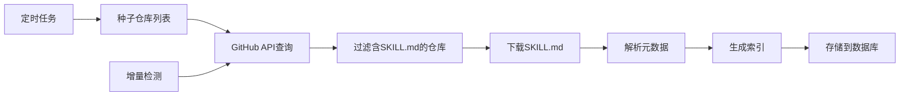

# Skill Seekers 爬虫配置指南

> **版本**: v1.0  
> **更新日期**: 2026-04-18  
> **目标**: 使用Skill Seekers作为核心爬虫引擎，自动发现和索引GitHub上的Skills

---

## 📋 目录

- [Skill Seekers简介](#skill-seekers简介)
- [项目架构](#项目架构)
- [安装与配置](#安装与配置)
- [集成到SkillHub](#集成到skillhub)
- [爬虫策略](#爬虫策略)
- [数据解析](#数据解析)
- [定时任务配置](#定时任务配置)
- [性能优化](#性能优化)
- [故障排查](#故障排查)
- [最佳实践](#最佳实践)

---

## Skill Seekers简介

### 什么是Skill Seekers?

Skill Seekers (https://github.com/yusufkaraaslan/Skill_Seekers) 是一个专门用于发现和索引AI Agent Skills的开源爬虫工具。

**核心功能**:
- 🔍 自动扫描GitHub仓库
- 📄 识别SKILL.md文件
- 🏷️ 提取Skill元数据
- 📊 生成标准化索引
- ⚡ 高性能并发爬取

### 为什么选择Skill Seekers?

1. **专注性**: 专门为Skills设计，不是通用爬虫
2. **准确性**: 精确识别SKILL.md格式和结构
3. **可扩展**: 易于定制和扩展
4. **开源**: Apache 2.0协议，可自由修改
5. **活跃维护**: 社区持续更新和改进

---

## 项目架构

### Skill Seekers核心组件

```
Skill Seekers/
├── crawler/           # 爬虫核心
│   ├── GitHubCrawler.ts    # GitHub仓库爬取
│   ├── Parser.ts           # SKILL.md解析器
│   └── RateLimiter.ts      # 速率限制器
├── indexer/           # 索引器
│   ├── IndexBuilder.ts     # 构建索引
│   └── SearchEngine.ts     # 搜索接口
├── models/            # 数据模型
│   └── Skill.ts            # Skill数据结构
├── config/            # 配置
│   └── default.json        # 默认配置
└── utils/             # 工具函数
    ├── logger.ts             # 日志
    └── helpers.ts            # 辅助函数
```

### 工作流程



---

## 安装与配置

### Step 1: Fork或Clone仓库

```bash
# Fork到自己的组织（推荐）
# 访问 https://github.com/yusufkaraaslan/Skill_Seekers 点击 Fork

# 或者克隆后修改
git clone https://github.com/yusufkaraaslan/Skill_Seekers.git
cd Skill_Seekers
```

### Step 2: 安装依赖

```bash
npm install
```

### Step 3: 配置环境变量

```bash
# 复制示例配置
cp .env.example .env

# 编辑 .env 文件
```

```bash
# .env

# GitHub认证
GITHUB_TOKEN=ghp_your_personal_access_token

# 爬虫配置
CONCURRENT_WORKERS=10
REQUEST_DELAY=1000
MAX_RETRIES=3

# 输出配置
OUTPUT_DIR=./output
OUTPUT_FORMAT=json

# SkillHub集成
SKILLHUB_API_URL=http://localhost:3000/api/v1
SKILLHUB_API_KEY=your_skillhub_api_key
```

### Step 4: 获取GitHub Token

1. 访问 https://github.com/settings/tokens
2. 点击 "Generate new token (classic)"
3. 选择权限:
   - ✅ `repo` (访问私有仓库)
   - ✅ `public_repo` (访问公开仓库)
   - ✅ `read:user` (读取用户信息)
4. 生成并复制Token
5. 添加到 `.env` 文件

**注意**: GitHub Personal Access Token的速率限制为5000 requests/hour

---

## 集成到SkillHub

### Step 1: 创建适配器

```typescript
// lib/crawlers/SkillSeekersAdapter.ts

import { spawn } from 'child_process';
import { prisma } from '@/lib/prisma';
import fs from 'fs/promises';
import path from 'path';

interface SkillSeekersConfig {
  githubToken: string;
  workers?: number;
  delay?: number;
  outputDir?: string;
}

interface CrawledSkill {
  name: string;
  description: string;
  author: string;
  version: string;
  repository_url: string;
  skill_md_url: string;
  package_url: string;
  tags: string[];
  languages: string[];
  stars: number;
  updated_at: string;
}

export class SkillSeekersAdapter {
  private config: SkillSeekersConfig;
  private crawlerPath: string;

  constructor(config: SkillSeekersConfig) {
    this.config = {
      workers: 10,
      delay: 1000,
      outputDir: './output',
      ...config,
    };
    
    // Skill Seekers可执行文件路径
    this.crawlerPath = path.join(__dirname, '../../skill-seekers/dist/index.js');
  }

  /**
   * 执行爬取任务
   */
  async crawl(searchQuery: string): Promise<CrawledSkill[]> {
    console.log(`Starting crawl for: ${searchQuery}`);

    return new Promise((resolve, reject) => {
      const child = spawn('node', [
        this.crawlerPath,
        '--query', searchQuery,
        '--token', this.config.githubToken,
        '--workers', String(this.config.workers!),
        '--delay', String(this.config.delay!),
        '--output', this.config.outputDir!,
        '--format', 'json'
      ]);

      let stdout = '';
      let stderr = '';

      child.stdout.on('data', (data) => {
        stdout += data.toString();
        console.log('[SkillSeekers]', data.toString().trim());
      });

      child.stderr.on('data', (data) => {
        stderr += data.toString();
        console.error('[SkillSeekers Error]', data.toString().trim());
      });

      child.on('close', async (code) => {
        if (code !== 0) {
          reject(new Error(`Crawler exited with code ${code}: ${stderr}`));
          return;
        }

        try {
          // 读取输出文件
          const outputFile = path.join(this.config.outputDir!, 'results.json');
          const content = await fs.readFile(outputFile, 'utf-8');
          const results: CrawledSkill[] = JSON.parse(content);

          console.log(`Crawl completed: ${results.length} skills found`);
          resolve(results);
        } catch (error) {
          reject(error);
        }
      });

      child.on('error', (error) => {
        reject(error);
      });
    });
  }

  /**
   * 将爬取结果导入SkillHub数据库
   */
  async importToSkillHub(skills: CrawledSkill[]): Promise<{
    success: number;
    failed: number;
    errors: string[];
  }> {
    const result = {
      success: 0,
      failed: 0,
      errors: [] as string[],
    };

    for (const skill of skills) {
      try {
        await prisma.skill.upsert({
          where: {
            source_sourceId: {
              source: 'github',
              sourceId: skill.repository_url,
            },
          },
          update: {
            name: skill.name,
            description: skill.description,
            authorName: skill.author,
            version: skill.version,
            repositoryUrl: skill.repository_url,
            documentationUrl: skill.skill_md_url,
            packageUrl: skill.package_url,
            tags: skill.tags,
            languages: skill.languages,
            starCount: skill.stars,
            updatedAt: new Date(skill.updated_at),
            syncStatus: 'synced',
            lastSyncedAt: new Date(),
          },
          create: {
            name: skill.name,
            slug: this.generateSlug(skill.name),
            description: skill.description,
            version: skill.version,
            source: 'github',
            sourceId: skill.repository_url,
            sourceUrl: skill.skill_md_url,
            authorName: skill.author,
            authorUrl: `https://github.com/${skill.author}`,
            repositoryUrl: skill.repository_url,
            documentationUrl: skill.skill_md_url,
            packageUrl: skill.package_url,
            tags: skill.tags,
            languages: skill.languages,
            starCount: skill.stars,
            downloadCount: 0,
            qualityScore: this.calculateQualityScore(skill),
            syncStatus: 'synced',
            lastSyncedAt: new Date(),
            createdAt: new Date(),
            updatedAt: new Date(skill.updated_at),
          } as any,
        });

        result.success++;
      } catch (error: any) {
        result.failed++;
        result.errors.push(`Failed to import ${skill.name}: ${error.message}`);
        console.error(error);
      }
    }

    return result;
  }

  /**
   * 计算质量评分
   */
  private calculateQualityScore(skill: CrawledSkill): number {
    let score = 0;

    // Stars权重 (0-40分)
    score += Math.min(40, (skill.stars / 100) * 40);

    // 描述完整性 (0-20分)
    if (skill.description && skill.description.length > 50) {
      score += 20;
    } else if (skill.description && skill.description.length > 20) {
      score += 10;
    }

    // 标签数量 (0-20分)
    score += Math.min(20, skill.tags.length * 4);

    // 语言多样性 (0-10分)
    score += Math.min(10, skill.languages.length * 5);

    // 最近更新 (0-10分)
    const daysSinceUpdate = (Date.now() - new Date(skill.updated_at).getTime()) / (1000 * 60 * 60 * 24);
    if (daysSinceUpdate < 30) {
      score += 10;
    } else if (daysSinceUpdate < 90) {
      score += 5;
    }

    return Math.round(score);
  }

  /**
   * 生成slug
   */
  private generateSlug(name: string): string {
    return name
      .toLowerCase()
      .replace(/[^a-z0-9]+/g, '-')
      .replace(/^-|-$/g, '');
  }

  /**
   * 清理输出目录
   */
  async cleanup(): Promise<void> {
    try {
      await fs.rm(this.config.outputDir!, { recursive: true, force: true });
      console.log('Output directory cleaned');
    } catch (error) {
      console.error('Failed to clean output directory:', error);
    }
  }
}
```

### Step 2: 创建爬虫服务

```typescript
// lib/services/CrawlerService.ts

import { SkillSeekersAdapter } from '../crawlers/SkillSeekersAdapter';
import { prisma } from '@/lib/prisma';

export class CrawlerService {
  private adapter: SkillSeekersAdapter;

  constructor() {
    this.adapter = new SkillSeekersAdapter({
      githubToken: process.env.GITHUB_TOKEN!,
      workers: parseInt(process.env.CRAWLER_WORKERS || '10'),
      delay: parseInt(process.env.CRAWLER_DELAY || '1000'),
      outputDir: process.env.CRAWLER_OUTPUT_DIR || './output/crawler',
    });
  }

  /**
   * 执行每日自动爬取
   */
  async dailyCrawl(): Promise<void> {
    console.log('Starting daily crawl...');

    try {
      // 记录任务开始
      const task = await prisma.crawlerTask.create({
        data: {
          taskType: 'daily_crawl',
          target: 'github_trending',
          status: 'running',
          scheduledAt: new Date(),
        },
      });

      // 定义搜索查询
      const queries = [
        'SKILL.md path:/',
        'ai agent skill',
        'claude skill',
        'openclaw skill',
        'cursor skill',
      ];

      let totalSuccess = 0;
      let totalFailed = 0;
      const allErrors: string[] = [];

      // 逐个查询执行
      for (const query of queries) {
        try {
          console.log(`Crawling with query: ${query}`);
          
          // 执行爬取
          const skills = await this.adapter.crawl(query);
          
          // 导入数据库
          const result = await this.adapter.importToSkillHub(skills);
          
          totalSuccess += result.success;
          totalFailed += result.failed;
          allErrors.push(...result.errors);

          console.log(`Query "${query}" completed: ${result.success} success, ${result.failed} failed`);

          // 避免速率限制
          await this.sleep(5000);
        } catch (error: any) {
          console.error(`Failed to crawl query "${query}":`, error);
          allErrors.push(`Query "${query}": ${error.message}`);
        }
      }

      // 更新任务状态
      await prisma.crawlerTask.update({
        where: { id: task.id },
        data: {
          status: allErrors.length > 0 ? 'completed_with_errors' : 'completed',
          completedAt: new Date(),
          result: {
            totalSuccess,
            totalFailed,
            errors: allErrors,
          },
        },
      });

      console.log(`Daily crawl completed: ${totalSuccess} success, ${totalFailed} failed`);

      // 清理临时文件
      await this.adapter.cleanup();
    } catch (error) {
      console.error('Daily crawl failed:', error);
      
      // 记录失败
      await prisma.crawlerTask.create({
        data: {
          taskType: 'daily_crawl',
          target: 'github_trending',
          status: 'failed',
          errorMessage: error instanceof Error ? error.message : String(error),
        },
      });
    }
  }

  /**
   * 爬取指定仓库
   */
  async crawlRepository(repoUrl: string): Promise<void> {
    console.log(`Crawling repository: ${repoUrl}`);

    try {
      const skills = await this.adapter.crawl(`repo:${repoUrl}`);
      const result = await this.adapter.importToSkillHub(skills);

      console.log(`Repository crawl completed:`, result);
    } catch (error) {
      console.error(`Failed to crawl repository ${repoUrl}:`, error);
      throw error;
    }
  }

  private sleep(ms: number): Promise<void> {
    return new Promise(resolve => setTimeout(resolve, ms));
  }
}
```

---

## 爬虫策略

### 种子仓库发现策略

#### 策略1: 关键词搜索

```typescript
const searchQueries = [
  'SKILL.md',
  'ai agent skill',
  'claude code skill',
  'openclaw skill',
  'cursor ai skill',
  'anthropic skill',
];
```

#### 策略2: Topic过滤

```typescript
const topics = [
  'ai-agent',
  'claude-skill',
  'openclaw',
  'cursor-extension',
];
```

#### 策略3: 用户/组织监控

```typescript
const monitoredUsers = [
  'anthropics',
  'openclaw',
  // 添加更多活跃的Skill开发者
];
```

### 增量更新策略

```typescript
/**
 * 只爬取最近更新的仓库
 */
async function incrementalCrawl(since: Date) {
  const query = `SKILL.md pushed:>${since.toISOString().split('T')[0]}`;
  return await adapter.crawl(query);
}
```

### 去重策略

```typescript
/**
 * 基于仓库URL去重
 */
async function isDuplicate(repoUrl: string): Promise<boolean> {
  const existing = await prisma.skill.findFirst({
    where: {
      source: 'github',
      sourceId: repoUrl,
    },
  });
  return !!existing;
}
```

---

## 数据解析

### SKILL.md格式解析

典型的SKILL.md文件结构：

```markdown
---
name: smart-inventory-manager
description: AI-powered inventory management and replenishment
version: 1.2.0
author: john-doe
tags:
  - inventory
  - management
  - automation
  - business
permissions:
  - file:read
  - file:write
  - network:outbound
dependencies:
  "@ai-sdk/openai": "^0.1.0"
  "zod": "^3.22.0"
---

# Smart Inventory Manager

This skill helps businesses manage their inventory...
```

### 解析器实现

```typescript
// lib/parsers/SkillMarkdownParser.ts

import matter from 'gray-matter';

export interface SkillFrontmatter {
  name: string;
  description: string;
  version?: string;
  author?: string;
  tags?: string[];
  permissions?: string[];
  dependencies?: Record<string, string>;
}

export class SkillMarkdownParser {
  parse(content: string): {
    frontmatter: SkillFrontmatter;
    body: string;
  } {
    const parsed = matter(content);
    
    return {
      frontmatter: parsed.data as SkillFrontmatter,
      body: parsed.content,
    };
  }

  validate(frontmatter: SkillFrontmatter): {
    valid: boolean;
    errors: string[];
  } {
    const errors: string[] = [];

    if (!frontmatter.name) {
      errors.push('Missing required field: name');
    }

    if (!frontmatter.description) {
      errors.push('Missing required field: description');
    }

    if (frontmatter.description && frontmatter.description.length < 10) {
      errors.push('Description too short (min 10 characters)');
    }

    return {
      valid: errors.length === 0,
      errors,
    };
  }
}
```

---

## 定时任务配置

### 使用node-cron

```typescript
// lib/cron/githubCrawler.ts

import cron from 'node-cron';
import { CrawlerService } from '../services/CrawlerService';

const crawlerService = new CrawlerService();

// 每天凌晨3点执行全量爬取
cron.schedule('0 3 * * *', async () => {
  console.log('Starting scheduled GitHub crawl...');
  try {
    await crawlerService.dailyCrawl();
    console.log('Scheduled crawl completed');
  } catch (error) {
    console.error('Scheduled crawl failed:', error);
  }
});

// 每6小时执行增量更新
cron.schedule('0 */6 * * *', async () => {
  console.log('Starting incremental crawl...');
  try {
    const lastCrawl = await prisma.crawlerTask.findFirst({
      where: { taskType: 'daily_crawl' },
      orderBy: { startedAt: 'desc' },
    });

    if (lastCrawl && lastCrawl.completedAt) {
      // 实现增量爬取逻辑
      console.log('Incremental crawl not yet implemented');
    }
  } catch (error) {
    console.error('Incremental crawl failed:', error);
  }
});

console.log('GitHub crawler cron jobs registered');
```

### 使用Temporal.io (高级)

对于更复杂的工作流，可以使用Temporal.io:

```typescript
// workflows/CrawlerWorkflow.ts

import { proxyActivities } from '@temporalio/workflow';
import type * as activities from '../activities/crawlerActivities';

const { crawlGitHub, importToDatabase } = proxyActivities<typeof activities>({
  startToCloseTimeout: '30 minutes',
});

export async function dailyCrawlWorkflow() {
  const skills = await crawlGitHub();
  await importToDatabase(skills);
}
```

---

## 性能优化

### 1. 并发控制

```typescript
// 限制并发请求数
const semaphore = new Semaphore(10); // 最多10个并发

async function crawlWithLimit(repo: string) {
  await semaphore.acquire();
  try {
    return await crawlRepo(repo);
  } finally {
    semaphore.release();
  }
}
```

### 2. 缓存策略

```typescript
// 缓存已处理的仓库元数据
const repoCache = new NodeCache({ stdTTL: 86400 }); // 24小时

async function getRepoMetadata(repo: string) {
  const cached = repoCache.get(repo);
  if (cached) return cached;

  const metadata = await fetchFromGitHub(repo);
  repoCache.set(repo, metadata);
  return metadata;
}
```

### 3. 批量数据库操作

```typescript
// 使用事务批量插入
await prisma.$transaction(async (tx) => {
  for (const skill of skills) {
    await tx.skill.upsert({
      where: { /* ... */ },
      update: { /* ... */ },
      create: { /* ... */ },
    });
  }
}, {
  timeout: 60000, // 60秒超时
});
```

### 4. 速率限制遵守

```typescript
// GitHub API速率限制: 5000 requests/hour
const rateLimiter = new RateLimiter({
  maxRequests: 5000,
  period: 3600000, // 1小时
});

async function makeGitHubRequest() {
  await rateLimiter.waitForToken();
  return await githubAPI.request();
}
```

---

## 故障排查

### 问题1: GitHub API速率限制

**症状**: 收到403 Forbidden错误

**解决**:
1. 检查当前速率限制状态:
   ```bash
   curl -H "Authorization: token YOUR_TOKEN" https://api.github.com/rate_limit
   ```
2. 减少并发worker数量
3. 增加请求间隔
4. 使用多个Token轮换

### 问题2: 爬取速度慢

**原因**: 网络延迟或GitHub响应慢

**解决**:
1. 增加并发workers (但注意速率限制)
2. 优化查询条件，减少不必要的请求
3. 使用GitHub GraphQL API (更高效)
4. 实施智能缓存

### 问题3: SKILL.md解析失败

**原因**: 文件格式不规范

**解决**:
1. 添加容错处理
2. 记录失败的仓库用于人工审核
3. 支持多种格式变体
4. 提供默认值

### 问题4: 内存溢出

**原因**: 一次性加载太多数据

**解决**:
1. 使用流式处理
2. 分批处理结果
3. 及时清理临时文件
4. 监控内存使用情况

---

## 最佳实践

### 1. 错误处理

```typescript
try {
  await crawl();
} catch (error) {
  // 记录详细错误信息
  logger.error({
    message: 'Crawl failed',
    error: error.message,
    stack: error.stack,
    timestamp: new Date().toISOString(),
  });
  
  // 通知管理员
  await notifyAdmin(error);
  
  // 不要中断整个流程
  continue;
}
```

### 2. 日志记录

```typescript
// 结构化日志
console.log(JSON.stringify({
  level: 'info',
  message: 'Crawl started',
  query: searchQuery,
  timestamp: new Date().toISOString(),
}));
```

### 3. 监控告警

- 监控爬取成功率
- 监控API配额使用
- 设置失败率阈值告警
- 定期生成爬取报告

### 4. 数据质量

- 验证必需字段
- 检查URL有效性
- 去重处理
- 定期清理失效数据

### 5. 合规性

- ✅ 遵守GitHub Terms of Service
- ✅ 尊重robots.txt
- ✅ 合理使用API配额
- ✅ 标注数据来源

---

## 总结

通过本指南，您已经完成了Skill Seekers与SkillHub的集成。关键要点：

✅ 正确配置GitHub Token和爬虫参数  
✅ 实现数据适配器和导入服务  
✅ 设置定时任务自动爬取  
✅ 优化性能和错误处理  
✅ 遵守GitHub API规范  

下一步：结合SkillsMP数据和Skill Seekers爬取结果，构建完整的全球Skills搜索引擎。

---

**相关文档**:
- [GLOBAL_SKILLS_SEARCH_PLAN.md](./GLOBAL_SKILLS_SEARCH_PLAN.md) - v2.0整体规划
- [SKILLSMP_INTEGRATION_GUIDE.md](./SKILLSMP_INTEGRATION_GUIDE.md) - SkillsMP集成指南
- [GLOBAL_SEARCH_ARCHITECTURE.md](./GLOBAL_SEARCH_ARCHITECTURE.md) - 搜索架构设计

**支持**:
如有问题，请提交GitHub Issue或联系技术支持。
